# 架构设计 — subconverter-ts

> **版本** `v0.9.0` · **运行时** Cloudflare Workers（`wrangler 4`，`compatibility_date 2024-01-01` + `nodejs_compat`）· **语言** TypeScript 5.6（严格模式）

本文描述 `subconverter-ts` 的系统全貌、模块划分、请求数据流、存储与安全设计。所有路径均以仓库根为基准，唯一事实来源见 `spec.md`，类型事实来源为 `src/types.ts`。

---

## 目录

1. [系统总览](#1-系统总览)
2. [运行时拓扑与整体时序](#2-运行时拓扑与整体时序)
3. [路由与调度](#3-路由与调度)
4. [转换管线 7 步](#4-转换管线-7-步)
5. [模块地图](#5-模块地图)
6. [关键数据流](#6-关键数据流)
7. [存储设计](#7-存储设计)
8. [安全设计](#8-安全设计)
9. [构建与产物](#9-构建与产物)
10. [约束与非目标](#10-约束与非目标)
11. [附录：常量与引用](#11-附录常量与引用)

---

## 1. 系统总览

`subconverter-ts` 是部署于 Cloudflare Workers 上的订阅转换服务，单一 Worker 同时承载两类面：

- **转换面**：`GET /sub`（含 `HEAD`）及快捷路径 `/sub2clashr`、`/surge2clash`，将异构订阅源转换为 13 种目标客户端配置。
- **管控面**：`dashboard/` 单页应用（SPA）通过 `assets` 绑定同域托管，`GET /dashboard/api/*` 提供域名、ACL、限流、日志、缓存、配置与调试接口。

核心思想是**无本地文件系统**：上游订阅通过 `fetch`（`src/handler/webget.ts`）拉取，内存 `Map` 做进程内缓存，跨请求持久化与管控状态落在 `KV` 与 `D1`。

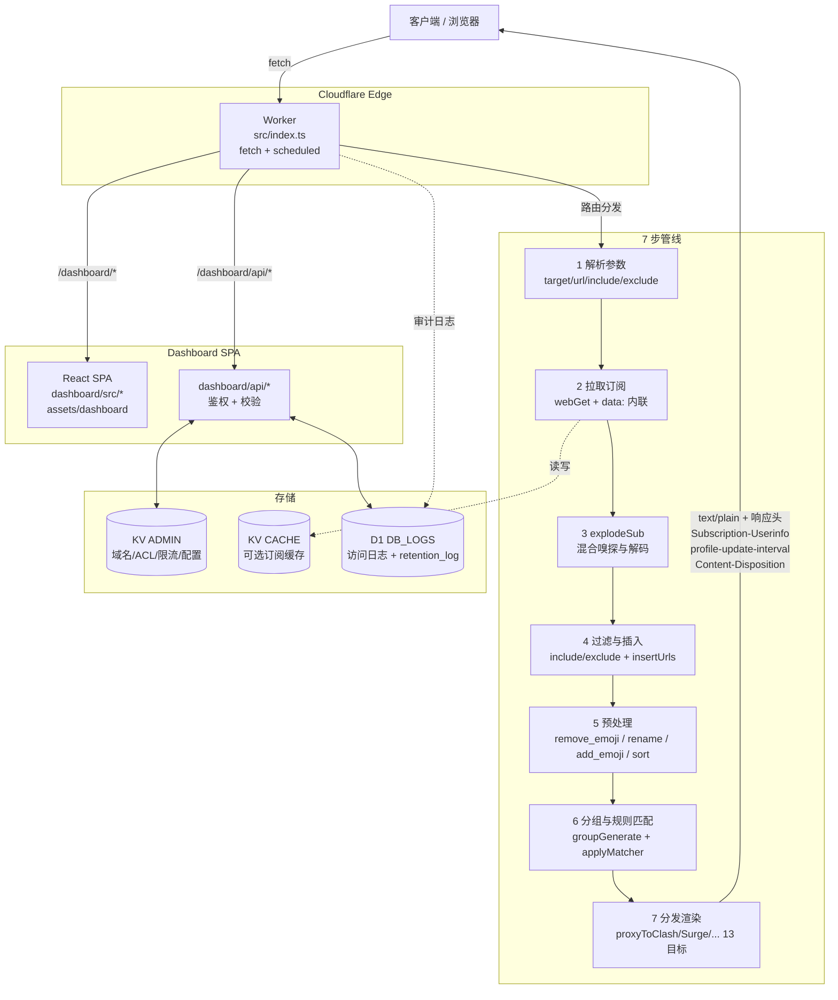

### 设计目标

| 目标 | 说明 | 取舍 |
|------|------|------|
| 单 Worker 交付 | 转换与管控同域，避免跨域与额外网关 | Worker 体积需控制在 1 MiB 内（当前约 235 KiB，明文 48 KiB gzip） |
| 零文件系统 | 所有持久化通过 `KV`/`D1`/`assets` | 原有本地文件读写能力以受限 API 替代 |
| 确定性管线 | 7 步顺序为契约，不因参数缺省而重排 | 单个失败链接可跳过，不中断整批 |
| 可观测 | `observability.enabled` + 结构化日志 + D1 审计 | 敏感订阅原文不落库 |

---

## 2. 运行时拓扑与整体时序

### 2.1 部署拓扑

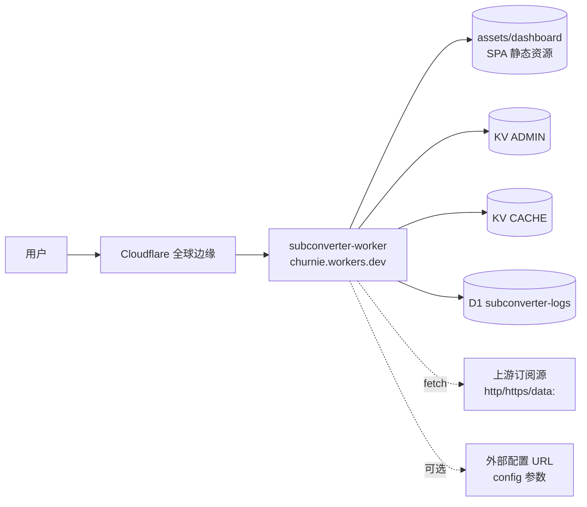

- `assets` 绑定 `ASSETS`，`not_found_handling = "single-page-application"`，`/dashboard/*` 未命中回退 `index.html` 由前端路由接管。
- `KV` 与 `D1` 均通过 `wrangler.toml` 的 `binding` 注入 `env`，缺失时管控接口优雅降级（返回空或只读）。

### 2.2 请求生命周期

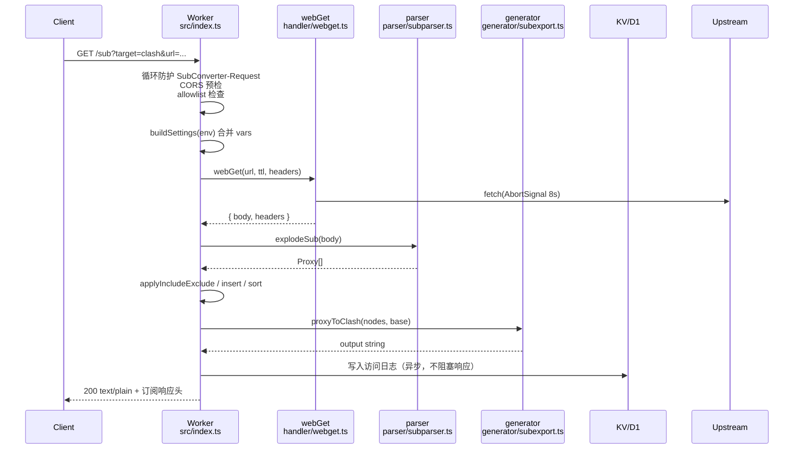

---

## 3. 路由与调度

`src/index.ts` 的 `export default { fetch, scheduled }` 为唯一入口。所有路由在 `fetch` 内以 `URL.pathname` + `method` 分发，首要检查为 `SubConverter-Request` 循环防护（命中直接 `500 Loop detected`）。

### 3.1 路由表

| Method | Path | 处理 | 说明 |
|--------|------|------|------|
| `GET` | `/` | 内联 | 健康检查，空串 `200` |
| `GET` | `/version` | 内联 | 返回 `v0.9.0` |
| `GET`/`HEAD` | `/sub` | `handleSub` | 主转换，`HEAD` 去 body |
| `GET` | `/sub2clashr` | `handleSub` 包装 | 强制 `target=clashr` |
| `GET` | `/surge2clash` | 专用 | Surge 文本 → Clash |
| `GET` | `/refreshrules` | stub | 刷新规则，`token` 校验 |
| `GET` | `/readconf` | KV 读取 | 返回偏好原文 |
| `POST` | `/updateconf` | KV 写入 | `postdata` 覆盖偏好 |
| `GET` | `/flushcache` | `flushCache()` | 清内存 `Map`，`token` 严格比对 |
| `GET` | `/render` | 模板 | 受限渲染 |
| `OPTIONS` | `*` | CORS 预检 | 结合 allowlist 决定 `403` 或 `Allow-Methods` |
| `GET` | `/dashboard/api/*` | `handler/dashboard.ts` | 管控 API，见下表 |
| `GET` | `/dashboard/*` | `assets` | SPA 静态资源 |
| `*` | 其他 | `404` | 未匹配 |

### 3.2 Dashboard API

| Method | Path | 处理函数 | 鉴权 | 存储 |
|--------|------|----------|------|------|
| `POST` | `/dashboard/api/auth` | `handleAuth` | 无（校验后签发） | `KV_ADMIN` |
| `GET` | `/dashboard/api/domains` | `handleDomainsGet` | `Bearer` | `KV_ADMIN` |
| `POST` | `/dashboard/api/domains` | `handleDomainsPost` | `Bearer` | `KV_ADMIN` |
| `DELETE` | `/dashboard/api/domains` | `handleDomainsDelete` | `Bearer` | `KV_ADMIN` |
| `GET`/`POST` | `/dashboard/api/acl/:type` | `handleAcl` | `Bearer` | `KV_ADMIN` |
| `GET` | `/dashboard/api/limits` | `handleLimitsGet` | `Bearer` | `KV_ADMIN` |
| `PUT` | `/dashboard/api/limits` | `handleLimitsPut` | `Bearer` | `KV_ADMIN` |
| `GET` | `/dashboard/api/logs` | `handleLogsGet` | `Bearer` | `D1` |
| `POST` | `/dashboard/api/logs/retention` | `handleLogsRetentionPost` | `Bearer` | `KV_ADMIN` + `D1` |
| `GET` | `/dashboard/api/cache` | `handleCacheGet` | `Bearer` | 内存 `Map` |
| `POST` | `/dashboard/api/cache/flush` | `handleCacheFlush` | `Bearer` | 内存 `Map` |
| `POST` | `/dashboard/api/cache/refresh` | `handleCacheRefresh` | `Bearer` | `webGet` |
| `GET` | `/dashboard/api/config` | `handleConfigGet` | `Bearer` | `KV_ADMIN` |
| `POST` | `/dashboard/api/debug` | `handleDebugPost` | `Bearer` | 无（即时解析） |

### 3.3 调度器

`scheduled` 仅执行 `scheduledPurge`，按 `retention:days` 定期清理 `D1` 过期日志，避免无界增长。触发由 Cloudflare Cron 绑定（`wrangler.toml` 的 `triggers.crons`，如配置）。

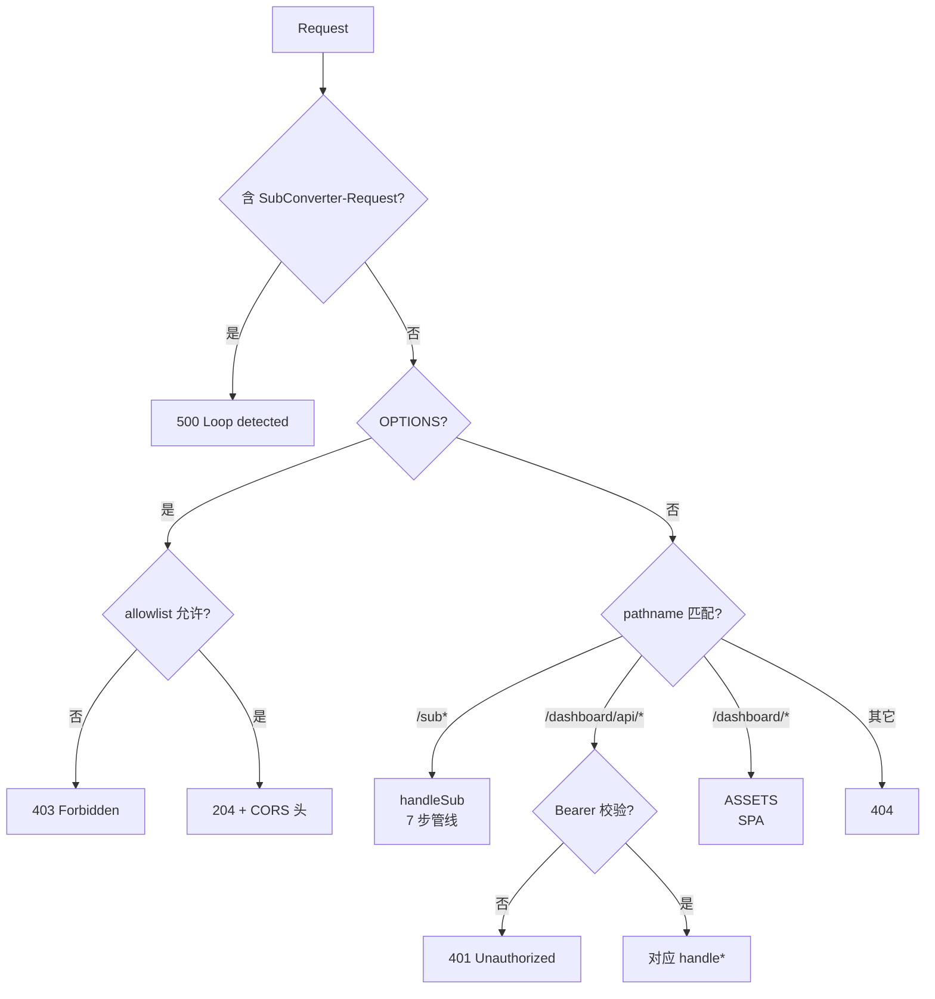

---

## 4. 转换管线 7 步

`handleSub` 内管线顺序为契约，任何重排需先更新 `spec.md` 并通过评审。以下为 `src/index.ts:139-411` 的逻辑抽象。

```mermaid
flowchart LR
    A[解析参数<br/>target/url/config/include/exclude/filename/interval/append_info/ver/group/sort<br/>buildSettings + loadExternalConfig] --> B
    B[校验<br/>target ∈ ALLOWED_TARGETS<br/>include/exclude 正则合法<br/>URL 非空 + 长度 ≤16384] --> C
    C[拉取<br/>insertUrls 先行 + 主 url<br/>extractFetchUrl<br/>direct proxy link 直通<br/>webGet + Subscription-Userinfo 提取<br/>subRequestLimit 50] --> D
    D[解析<br/>explodeSub<br/>混合嗅探: base64 / Clash YAML / Surge INI / 单链] --> E
    E[过滤与合并<br/>applyIncludeExclude per-sub<br/>GroupId 分配 + 全局 Id 重排<br/>group 覆盖] --> F
    F[预处理<br/>filter_script stub<br/>sort 按 remark 排序] --> G
    G[分发<br/>switch target → proxyToClash/Surge/Mellow/...<br/>mixed base64 编码<br/>MANAGED-CONFIG 注入]
    G --> H[响应头装配<br/>Content-Type / Subscription-Userinfo / profile-update-interval / Content-Disposition]
```

### 4.1 各步要点

| 步骤 | 输入 | 输出 | 关键实现 | 失败策略 |
|------|------|------|----------|----------|
| 1 参数解析 | `URLSearchParams` + `env` | `Settings` + 原始参数 | `buildSettings(env)` 合并 `API_MODE`/`API_TOKEN`/`MANAGED_PREFIX`/`DEFAULT_URL`；`loadExternalConfig(config, webGet)` 尽力而为 | 外部配置拉取失败不抛错 |
| 2 校验 | `target`/`include`/`exclude`/`effectiveUrl` | 校验结果 | `ALLOWED_TARGETS` 集合；`isValidRegex` 逐段校验；`effectiveUrl = urlParam \|\| defaultUrls \|\| insertUrls` | `400 Invalid target/url/regex` |
| 3 拉取 | `effectiveUrl` 的 `\|` 分割 | `body` + `respHeaders` 逐源 | `extractFetchUrl`；`isDirectProxyLink` 正则直通 `ss://` 等；`webGet(url, ttl)` 8s 超时；`Subscription-Userinfo` 大小写不敏感提取；`data:` 零 TTL | 单源失败跳过（`skipFailedLinks` 控制） |
| 4 解析 | `body` 字符串 | `Proxy[]` | `explodeSub` 链：`tryBase64DecodeFull` → `explodeClash` → `explodeSurge` → 单链 `explode` 逐行 | 单行解析失败静默丢弃 |
| 5 过滤与合并 | `Proxy[]` per-sub | `allNodes: Proxy[]` | `applyIncludeExclude`（`regFind` 语义，`\|`/`\`` 分隔）；`insertUrls` 组 `gid=-1` 递减，主组 `gid=0` 递增；全局 `Id` 重排 | 空结果不报错，进入分发空输出 |
| 6 预处理 | `allNodes` | `allNodes` | `sort=true/1` 时按 `remark.localeCompare`；`group` 覆盖 stub | 无操作 |
| 7 分发 | `allNodes` + `target` + `base` | `output: string` | `switch` 13 分支；`mixed` 额外 `btoa`；`surge` 的 `writeManagedConfig` 注入 `#!MANAGED-CONFIG` | `try/catch` 包裹，异常置空输出 |

### 4.2 目标分发矩阵

| `target` | 函数 | 说明 |
|----------|------|------|
| `clash` | `proxyToClash(nodes, base, false)` | 标准 Clash |
| `clashr` | `proxyToClash(nodes, base, true)` | ClashR |
| `surge` | `proxyToSurge(nodes, base, ver)` | `ver` 2/3/4，默认 4 |
| `surfboard` | `proxyToSurge(nodes, base, -3)` | Surfboard 变体 |
| `mellow` | `proxyToMellow(nodes, base)` | Mellow |
| `sssub` | `proxyToSSSub(nodes, base)` | SS 订阅 |
| `ss` | `proxyToSingle(filter SS)` | 单 `ss://` 列表 |
| `ssr` | `proxyToSingle(filter SSR)` | 单 `ssr://` 列表 |
| `v2ray` | `proxyToSingle(filter VMess)` | `vmess://` 列表 |
| `trojan` | `proxyToSingle(filter Trojan)` | `trojan://` 列表 |
| `mixed` | `proxyToSingle(all, 15)` + `btoa` | 混合 base64 订阅 |
| `quan` | `proxyToQuan(nodes, base)` | Quantumult |
| `quanx` | `proxyToQuanX(nodes, base)` | Quantumult X |
| `loon` | `proxyToLoon(nodes, base)` | Loon |
| `ssd` | `proxyToSSD(nodes, base)` | SSD |
| `singbox` | `proxyToSingBox(nodes, base)` | SingBox JSON |

---

## 5. 模块地图

### 5.1 `src/*` 服务端

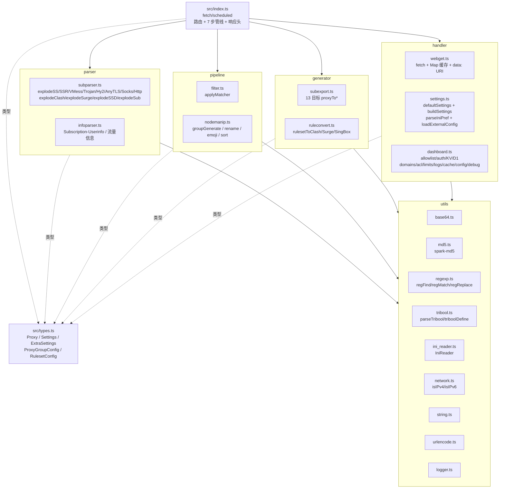

#### 模块职责表

| 模块 | 文件 | 职责 | 关键导出 |
|------|------|------|----------|
| 入口 | `src/index.ts` | 路由分发、7 步管线编排、响应头装配、循环防护、CORS | `fetch`, `scheduled`, `handleSub` |
| 类型 | `src/types.ts` | 全部领域类型，`Proxy` 为核心节点抽象 | `Proxy`, `ProxyType`, `Settings`, `ExtraSettings`, `ProxyGroupConfig`, `RulesetConfig` |
| 网络拉取 | `src/handler/webget.ts` | `fetch` 封装、`AbortSignal` 8s 超时、内存 `Map` 缓存、`data:` URI 解析 | `webGet`, `flushCache` |
| 配置 | `src/handler/settings.ts` | 默认配置、环境变量合并、INI 偏好解析、外部配置拉取 | `buildSettings`, `parseIniPref`, `loadExternalConfig` |
| 管控 | `src/handler/dashboard.ts` | allowlist/auth、KV/D1 读写、全部 `dashboard/api/*` 处理器、定时清理 | `checkAllowlist`, `requireAuth`, `handleDomains*`, `handleAcl`, `handleLimits*`, `handleLogs*`, `handleCache*`, `handleConfigGet`, `handleDebugPost`, `scheduledPurge` |
| 解析 | `src/parser/subparser.ts` | 全部协议解析、Clash YAML / Surge INI 嗅探、混合订阅链 | `explode`, `explodeSS`, `explodeSSR`, `explodeVMess`, `explodeTrojan`, `explodeHysteria2`, `explodeAnyTLS`, `explodeSocks`, `explodeHttp`, `explodeClash`, `explodeSurge`, `explodeSSD`, `explodeSub` |
| 信息 | `src/parser/infoparser.ts` | 流量与到期信息提取 | `parseSubInfo` 等 |
| 过滤 | `src/pipeline/filter.ts` | 规则驱动的节点过滤 | `applyMatcher` |
| 节点操作 | `src/pipeline/nodemanip.ts` | 分组生成、重命名、emoji、排序 | `groupGenerate`, `rename`, `applyEmoji`, `sortNodes` |
| 导出 | `src/generator/subexport.ts` | 13 目标渲染 | `proxyToClash`, `proxyToSurge`, `proxyToMellow`, `proxyToSSSub`, `proxyToSingle`, `proxyToQuan`, `proxyToQuanX`, `proxyToLoon`, `proxyToSSD`, `proxyToSingBox` |
| 规则转换 | `src/generator/ruleconvert.ts` | 规则集到各目标格式 | `rulesetToClash`, `rulesetToSurge`, `rulesetToSingBox` |
| 编码 | `src/utils/base64.ts` | URL-safe base64 编解码 | `urlSafeB64Encode/Decode` |
| 摘要 | `src/utils/md5.ts` | MD5（`spark-md5` 封装） | `md5` |
| 正则 | `src/utils/regexp.ts` | `regFind`/`regMatch`/`regReplace`/`regValid`，JS `RegExp` 对齐 `jpcre2` 语义 | `regFind`, `regMatch`, `regReplace`, `regValid` |
| 三态布尔 | `src/utils/tribool.ts` | `true/false/undef` 三态，参数优先级链 | `parseTribool`, `triboolDefine`, `triboolGet`, `TriboolWrapper` |
| INI | `src/utils/ini_reader.ts` | INI 解析（`storeAnyLine` 等选项） | `IniReader`, `parseIni` |
| 网络 | `src/utils/network.ts` | IP 校验 | `isIPv4`, `isIPv6` |
| 字符串 | `src/utils/string.ts` 等 | 通用字符串与 URL 编码 | `trim`, `urlEncode` 等 |

### 5.2 `dashboard/src/*` 前端

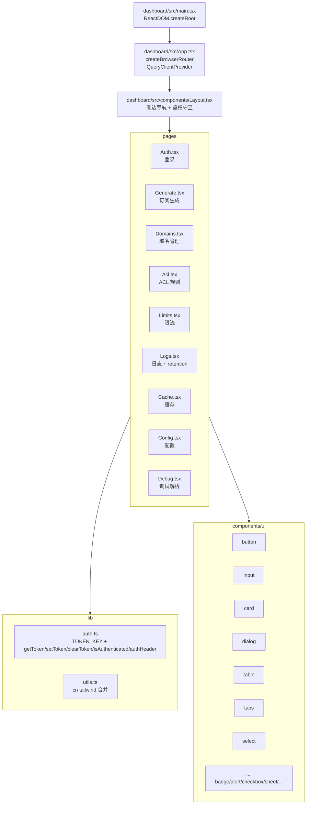

#### 前端路由表

| 路径 | 组件 | 鉴权 | 说明 |
|------|------|------|------|
| `/dashboard/auth` | `Auth.tsx` | 否 | 登录页，`setToken` 后跳转 |
| `/dashboard` | 重定向 | — | 已登录 → `/dashboard/generate`，否则 → `/dashboard/auth` |
| `/dashboard/generate` | `Generate.tsx` | 是 | 订阅生成器，可视化拼装 `/sub` 链接 |
| `/dashboard/domains` | `Domains.tsx` | 是 | 域名白名单增删查 |
| `/dashboard/acl` | `Acl.tsx` | 是 | ACL 黑白名单分 `type` 管理 |
| `/dashboard/limits` | `Limits.tsx` | 是 | 限流阈值 |
| `/dashboard/logs` | `Logs.tsx` | 是 | D1 日志分页与 retention 设置 |
| `/dashboard/cache` | `Cache.tsx` | 是 | 缓存查看与刷新 |
| `/dashboard/config` | `Config.tsx` | 是 | 偏好配置 |
| `/dashboard/debug` | `Debug.tsx` | 是 | 粘贴订阅即时解析预览 |
| `/` | 重定向 | — | → `/dashboard` |
| `*` | 重定向 | — | → `/dashboard` |

#### 关键前端约定

| 约定 | 实现 |
|------|------|
| 鉴权守卫 | `RequireAuth` 包裹需鉴权路由，未登录 `Navigate` 至 `/dashboard/auth` |
| 状态 | `zustand` + `@tanstack/react-query`（`retry: false`） |
| 样式 | `tailwindcss` + `tailwind-merge` + `clsx` + `class-variance-authority`，`lucide-react` 图标 |
| 表单 | `react-hook-form` + `zod` + `@hookform/resolvers` |
| 图表 | `recharts`（日志页） |
| 别名 | `vite.config.ts` 的 `@ → dashboard/src` |

---

## 6. 关键数据流

### 6.1 `/sub` 转换流

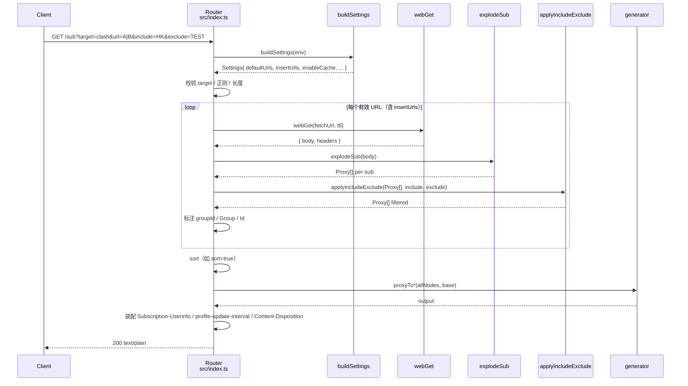

#### 参数处理细节

| 参数 | 位置 | 类型 | 语义 |
|------|------|------|------|
| `target` | query | enum | 必需，`auto` 按 `User-Agent` 嗅探归一 |
| `url` | query | string | `\|` 多源，`tag:` 前缀分组，`data:` 内联；与 `defaultUrls`/`insertUrls` 合并 |
| `config` | query | URL | 外部偏好，`loadExternalConfig` 尽力拉取 |
| `include`/`exclude` | query | regex | `\|`/`\`` 分隔，逐段 `regValid`，`regFind` 语义匹配 `remark` 等 |
| `filename` | query | string | 触发 `Content-Disposition: attachment` |
| `interval` | query | number | 覆盖 `configUpdateInterval` 用于 `profile-update-interval` |
| `append_info` | query | tribool | 控制是否透传 `Subscription-Userinfo` |
| `ver` | query | `2\|3\|4` | Surge 版本 |
| `group` | query | string | 组名覆盖（预留） |
| `sort` | query | tribool | `true/1` 时按 `remark` 排序 |

### 6.2 `/dashboard/api/*` 管控流

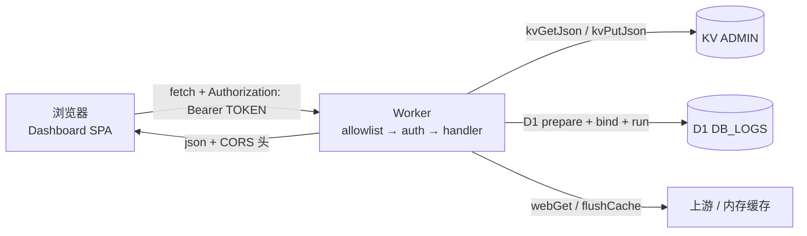

- 每个 `dashboard/api/*` 请求依次经过 `checkAllowlist` 与 `requireAuth`，任一失败直接返回对应状态码（`403` / `401`）及最小响应头。
- `KV` 操作均通过 `kvGetJson`/`kvPutJson` 包裹，`KV` 缺失时回退默认值，不抛错。
- `D1` 仅 `logs` 与 `retention_log` 两表相关，`getD1` 从 `env.DB_LOGS` 取，未绑定时日志接口返回空集。

---

## 7. 存储设计

### 7.1 绑定总览

| 绑定名 | 类型 | `wrangler.toml` 键 | 用途 |
|--------|------|--------------------|------|
| `ADMIN` | KV Namespace | `kv_namespaces.binding = "ADMIN"` | 管控面持久化 |
| `CACHE` | KV Namespace | `kv_namespaces.binding = "CACHE"` | 订阅缓存（可选） |
| `DB_LOGS` | D1 Database | `d1_databases.binding = "DB_LOGS"` | 访问日志与 retention 审计 |
| `ASSETS` | Assets | `assets.binding = "ASSETS"` | Dashboard SPA 静态资源 |

### 7.2 KV `ADMIN` 键设计

| Key | 类型 | 读写路径 | 说明 |
|-----|------|----------|------|
| `domains` | `string[]` | `handleDomains*` | 允许的域名列表 |
| `acl:black:<type>` / `acl:white:<type>` | `string[]` | `handleAcl` | ACL 黑白名单，`type ∈ {ip,domain,ua,remark}` |
| `acl:enabled:black` / `acl:enabled:white` | `boolean` | `handleAcl` | 黑白名单启用开关 |
| `limits` | `Limits` | `handleLimits*` | 限流配置，缺省 `DEFAULT_LIMITS` |
| `retention:days` | `number` | `handleLogsRetentionPost` | 日志保留天数，候选 `7/30/90/180/365` |
| `config` | `Settings` 片段 | `handleConfigGet` | 偏好配置 |
| 其他 | — | — | 后续扩展预留 |

### 7.3 KV `CACHE` 与内存缓存

| 层级 | 位置 | 生存期 | 失效 |
|------|------|--------|------|
| 内存 `Map` | `src/handler/webget.ts` 的 `cache: Map<string, CacheEntry>` | Worker 实例存活期 | `flushCache()`（`/flushcache` 与 `dashboard/api/cache/flush`） |
| KV `CACHE` | 边缘 KV | 按 `settings.cacheSubscription` TTL | 覆盖写入，`wrangler` 侧可配置过期 |

当前 `webGet` 的进程内 `Map` 为主缓存，`KV CACHE` 为可选持久化扩展，`ttl=0` 时跳过缓存（`data:` 固定零 TTL）。

### 7.4 D1 `DB_LOGS`

`schema.sql` 定义：

```sql
CREATE TABLE logs (
  id TEXT PRIMARY KEY,
  time INTEGER NOT NULL,          -- epoch ms
  ip TEXT NOT NULL,               -- 脱敏
  target TEXT,
  nodes INTEGER,
  cache TEXT,                     -- hit/miss
  status INTEGER,
  duration INTEGER,               -- ms
  detail TEXT,                    -- blocked_by_allowlist 等，非原文
  created_at INTEGER NOT NULL
);
CREATE INDEX idx_logs_time ON logs(time);
CREATE INDEX idx_logs_ip ON logs(ip);
CREATE INDEX idx_logs_target ON logs(target);

CREATE TABLE retention_log (
  id INTEGER PRIMARY KEY AUTOINCREMENT,
  changed_at INTEGER NOT NULL,
  old_days INTEGER,
  new_days INTEGER,
  changed_by TEXT
);
```

| 列 | 约束 | 说明 |
|----|------|------|
| `id` | PK | 随机或请求派生 |
| `time` / `created_at` | `INTEGER NOT NULL` | 均为 epoch ms，`time` 为请求时间 |
| `ip` | 脱敏 | 仅存脱敏后 IP，不存原始订阅 |
| `cache` | `hit/miss` | 命中情况 |
| `detail` | 文本 | 阻断原因等，不含订阅原文 |

`scheduledPurge` 按 `retention:days` 删除 `time < now - days*86400000` 的行，并写入 `retention_log` 审计。

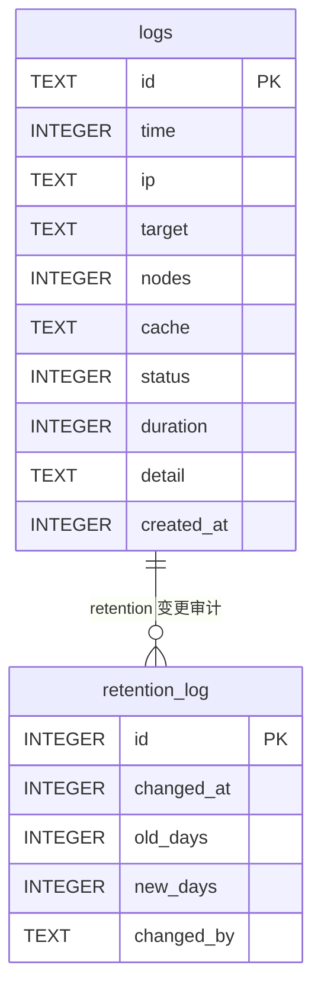

---

## 8. 安全设计

### 8.1 Allowlist

`checkAllowlist(request, env)` 为首道门控，适用于转换面与管控面（`OPTIONS` 预检亦参与）。

| 维度 | 来源 | 匹配 | 失败行为 |
|------|------|------|----------|
| 域名 | `KV ADMIN` 的 `domains` 或 `env.ALLOWLIST` | `hostFromUrl` 提取 host 比对 | `403 Forbidden`，不带 `Access-Control-Allow-Origin` |
| IP / UA / Remark | `KV ADMIN` 的 `acl:*` | `regFind` 语义（部分匹配） | 同上 |
| 启用开关 | `acl:enabled:black/white` | 关闭时跳过对应名单 | — |

成功时返回的 `headers` 需合并入最终响应的 CORS 头，失败时直接返回 `Response` 短路。

### 8.2 鉴权

| 场景 | 校验 | 细节 |
|------|------|------|
| `dashboard/api/*` | `requireAuth` | `Authorization: Bearer <token>` 与 `env.API_TOKEN`（或 `DASHBOARD_TOKEN`）比对，不一致 → `401` |
| `/flushcache` | `tokenMatches(url, env, true)` | `?token=` 必须与 `API_TOKEN` 严格相等（含空串比对） |
| `/sub` 等转换面 | `tokenMatches(url, env)` | 仅当 `API_TOKEN` 非空时校验 `?token=`，为空则放行 |
| `OPTIONS` 预检 | allowlist 先于鉴权 | 预检失败直接 `403`，不暴露鉴权头 |

`API_TOKEN` 禁止落 `wrangler.toml` 的 `vars` 明文，必须 `wrangler secret put API_TOKEN` 写入加密存储。

### 8.3 其他防护

| 项 | 实现 |
|----|------|
| 循环防护 | 任何含 `SubConverter-Request` 头的入站请求直接 `500 Loop detected` |
| CORS | `corsHeaders(request)` 按 `Origin` 回显，`Allow-Methods` 含 `GET,HEAD,POST,OPTIONS` |
| SSRF 收敛 | `API_MODE=true` 时 `/get`/`/getlocal` 不实现，仅 `/sub` 的 `url` 受控拉取 |
| 超时 | `webGet` 的 `fetch` 带 `AbortSignal.timeout(8000)` |
| 长度限制 | `request.url.length > 16384` → `414 URI Too Long` |
| 日志脱敏 | D1 不存订阅原文与完整 IP，仅计数与阻断原因 |

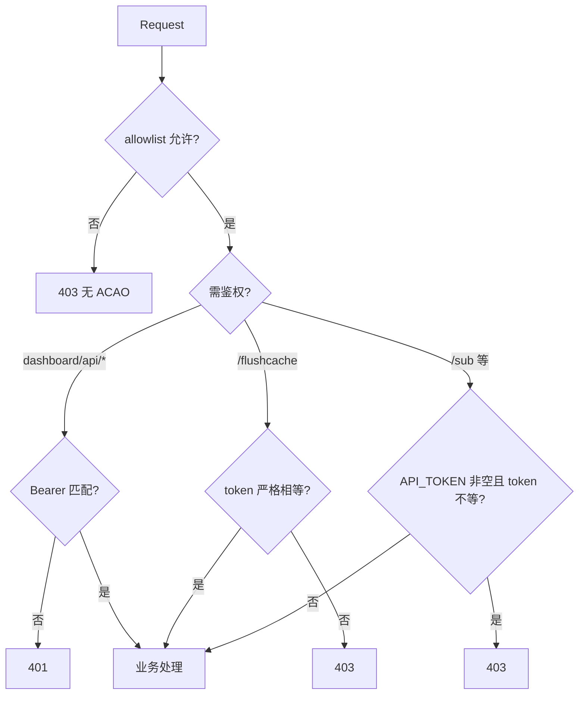

---

## 9. 构建与产物

### 9.1 依赖

| 依赖 | 版本 | 用途 |
|------|------|------|
| `js-yaml` | `^4.1.0` | Clash YAML 解析 |
| `spark-md5` | `^3.0.2` | MD5 摘要 |

其余零运行时依赖；`@cloudflare/workers-types`、`typescript`、`wrangler` 等为 dev 依赖。

### 9.2 产物体积

| 指标 | 数值 | 说明 |
|------|------|------|
| 明文 | ~235 KiB | `wrangler deploy --dry-run` 的 bundle |
| gzip | ~48 KiB | 边缘传输体积 |
| 上限 | 1 MiB | Workers 建议阈值，当前远低于 |

### 9.3 Assets

`dashboard/build` 输出至 `assets/dashboard`，`wrangler` 将其作为 `ASSETS` 绑定同 Worker 发布，`single-page-application` 模式保证前端路由刷新不 `404`。

---

## 10. 约束与非目标

| 约束 | 说明 |
|------|------|
| 无文件系统 | 不实现本地任意文件读取（`serve_file_root` 等），外部配置仅走 `fetch` |
| 单实例内存缓存 | `Map` 缓存不跨实例共享，强一致需 KV |
| Workers CPU/内存 | 长文本与大订阅需流式或分片，避免单次超限 |
| 浏览器兼容 | Dashboard 以现代浏览器为目标，不额外 polyfill 旧版 |

| 非目标 | 说明 |
|--------|------|
| 完整脚本引擎 | `filter_script` 等仅 stub，按需演进 |
| 服务端模板全量 | `inja` 模板以 `assets/base/all_base.tpl` 为基，后续增量补齐 |
| 多租户 | 当前单租户单 Worker，`KV` 命名空间隔离即租户边界 |

---

## 11. 附录：常量与引用

### 11.1 关键常量

| 常量 | 值 | 位置 |
|------|----|------|
| `VERSION` | `v0.9.0` | `src/index.ts` |
| `SERVER_HEADER` | `subconverter/v0.9.0 cURL/8.0` | `src/index.ts` |
| `subRequestLimit` | `50` | `src/index.ts:handleSub` |
| `DEFAULT_LIMITS` | 见 `src/handler/dashboard.ts` | 限流默认 |
| `RETENTION_ALLOWED` | `7/30/90/180/365` | `src/handler/dashboard.ts` |
| `TOKEN_KEY` | `dashboard_token` | `dashboard/src/lib/auth.ts` |

### 11.2 关键文件索引

| 文件 | 说明 |
|------|------|
| `src/index.ts` | 路由与管线编排 |
| `src/types.ts` | 领域类型 |
| `src/handler/webget.ts` | 拉取与缓存 |
| `src/handler/settings.ts` | 配置合并 |
| `src/handler/dashboard.ts` | 管控面实现 |
| `src/parser/subparser.ts` | 协议与配置解析 |
| `src/parser/infoparser.ts` | 流量信息 |
| `src/pipeline/filter.ts` | 过滤 |
| `src/pipeline/nodemanip.ts` | 节点操作 |
| `src/generator/subexport.ts` | 目标渲染 |
| `src/generator/ruleconvert.ts` | 规则转换 |
| `src/utils/tribool.ts` | 三态布尔 |
| `src/utils/regexp.ts` | 正则适配 |
| `src/utils/ini_reader.ts` | INI 解析 |
| `dashboard/src/App.tsx` | 前端路由 |
| `dashboard/src/lib/auth.ts` | 前端鉴权 |
| `wrangler.toml` | Worker 配置 |
| `schema.sql` | D1 建表 |
| `assets/base/all_base.tpl` | Clash 基模板 |

---

> 变更本文件所述管线顺序、allowlist 语义或存储键时，需同步更新 `spec.md` 与对应实现，并补充回归用例。
