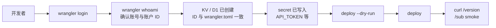
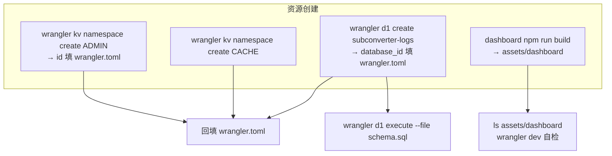
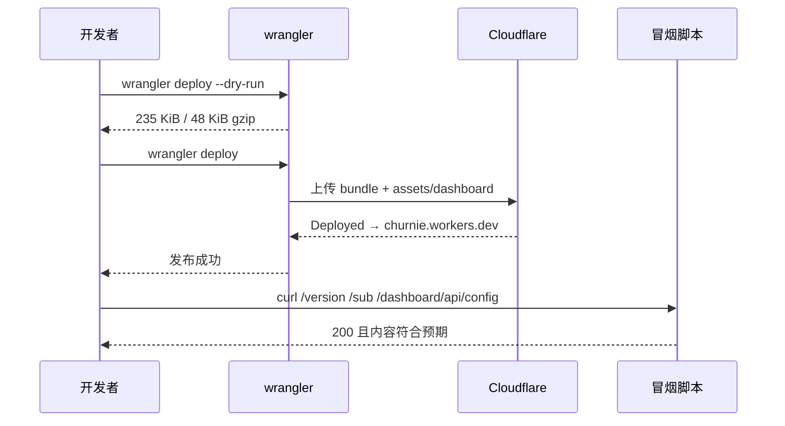
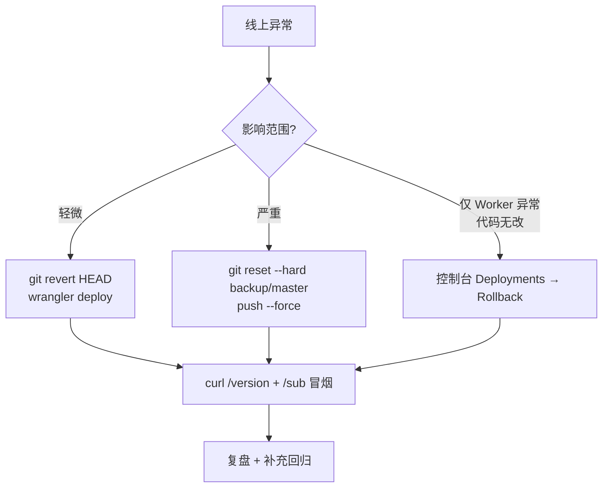

# 部署运维 — subconverter-ts

> **产物** `subconverter-worker` · **域名** `subconverter-worker.churnie.workers.dev` · **配置** `wrangler.toml`
> **兼容** `compatibility_date 2024-01-01` + `nodejs_compat` · **可观测** `observability.enabled true`
> 本文描述从资源创建到发布、密钥、观测与回滚的完整流程。规范事实见 `spec.md`，架构见 `docs/architecture.md`。

---

## 目录

1. [前置检查](#1-前置检查)
2. [Wrangler 配置](#2-wrangler-配置)
3. [资源创建](#3-资源创建)
4. [本地验证](#4-本地验证)
5. [部署步骤](#5-部署步骤)
6. [密钥与变量](#6-密钥与变量)
7. [域名与路由](#7-域名与路由)
8. [可观测性](#8-可观测性)
9. [回滚与备份](#9-回滚与备份)
10. [常见故障](#10-常见故障)
11. [附录](#11-附录)

---

## 1. 前置检查

### 1.1 账号与登录

```bash
npx wrangler --version   # 预期 ^4.126.0
npx wrangler whoami      # 查看已登录账号
npx wrangler login       # 浏览器授权，写入 ~/.wrangler/config
npx wrangler logout      # 登出
```

未登录时 `deploy` 将提示 `Not logged in` 并给出 `wrangler login` 链接。

### 1.2 版本与兼容

| 项 | 值 | 说明 |
|----|----|------|
| `name` | `subconverter-worker` | `wrangler.toml` 首行，决定 `*.workers.dev` 子域 |
| `main` | `src/index.ts` | Worker 入口，`modules` 格式 |
| `compatibility_date` | `2024-01-01` | 锁定 Workers 运行时行为 |
| `compatibility_flags` | `["nodejs_compat"]` | 启用 `Buffer`/`process` 等 Node 垫片 |
| `observability.enabled` | `true` | 启用日志与指标透传至 Cloudflare 控制台 |



---

## 2. Wrangler 配置

### 2.1 完整 `wrangler.toml`

```toml
name = "subconverter-worker"
main = "src/index.ts"
compatibility_date = "2024-01-01"
compatibility_flags = ["nodejs_compat"]

[vars]
API_MODE = "true"
API_TOKEN = ""
DEFAULT_URL = ""

[observability]
enabled = true

[assets]
directory = "./assets/dashboard"
binding = "ASSETS"
not_found_handling = "single-page-application"

[[kv_namespaces]]
binding = "ADMIN"
id = "f1bb7670b39046ddb3b5c2e01625624e"

[[kv_namespaces]]
binding = "CACHE"
id = "2e6da862cdb7410eb3fb72c1624f2520"

[[d1_databases]]
binding = "DB_LOGS"
database_name = "subconverter-logs"
database_id = "23c4d8dd-0797-4c83-8ea8-becb6b196cb0"
```

### 2.2 字段说明

| 字段 | 说明 | 修改影响 |
|------|------|----------|
| `name` | Worker 名称与 `workers.dev` 子域前缀 | 改名后旧域名 `churnie.workers.dev` 需重绑或保留 |
| `main` | 入口文件 | 改路径需同步 `package.json` 与 CI |
| `vars.API_MODE` | `true` 时禁用 `/get` 等文件面，收敛 SSRF | 生产保持 `true` |
| `vars.API_TOKEN` | 预留明文位，实际由 `secret` 覆盖 | 生产留空，仅 `secret` 注入 |
| `vars.DEFAULT_URL` | 默认订阅源 | 可留空，由 `?url=` 显式传入 |
| `assets.directory` | Dashboard 构建输出 | `dashboard/vite.config.ts` 的 `outDir` 必须一致 |
| `assets.not_found_handling` | `single-page-application` | 保证前端路由刷新回退 `index.html` |
| `kv_namespaces` | 两个命名空间 `ADMIN`/`CACHE` | `id` 需与实际 KV 一致，否则 `env.ADMIN` 为 `undefined` |
| `d1_databases` | `DB_LOGS` | `database_id` 需与实际 D1 一致，否则日志写入静默失败 |
| `observability.enabled` | 可观测 | 关闭后控制台无日志与指标 |

### 2.3 环境隔离

多环境时可在 `wrangler.toml` 追加：

```toml
[env.staging]
vars = { API_MODE = "true" }
[[env.staging.kv_namespaces]]
binding = "ADMIN"
id = "<staging kv id>"

[env.production]
vars = { API_MODE = "true" }
[[env.production.kv_namespaces]]
binding = "ADMIN"
id = "<prod kv id>"
```

发布时：

```bash
npx wrangler deploy --env staging
npx wrangler deploy --env production
```

未使用 `env` 时，默认即生产。

---

## 3. 资源创建

### 3.1 KV

```bash
# 创建（如首次）
npx wrangler kv namespace create ADMIN
# → { id: "f1bb7670b39046ddb3b5c2e01625624e" }
npx wrangler kv namespace create CACHE
# → { id: "2e6da862cdb7410eb3fb72c1624f2520" }

# 预览环境（可选）
npx wrangler kv namespace create ADMIN --preview

# 校验已存在
npx wrangler kv namespace list | jq '.[] | {title, id}'

# 读写自检
npx wrangler kv key put --binding ADMIN "probe" "ok"
npx wrangler kv key get --binding ADMIN "probe"   # ok
npx wrangler kv key delete --binding ADMIN "probe"

# 列出键
npx wrangler kv key list --binding ADMIN | jq
```

创建后将返回的 `id` 回填 `wrangler.toml` 的 `kv_namespaces`，否则 `env.ADMIN` / `env.CACHE` 为 `undefined`，管控接口回退为空。

### 3.2 D1

```bash
# 创建（如首次）
npx wrangler d1 create subconverter-logs
# → database_id: 23c4d8dd-0797-4c83-8ea8-becb6b196cb0

# 列出
npx wrangler d1 list | jq '.[] | {name, uuid}'

# 建表
npx wrangler d1 execute subconverter-logs --file schema.sql
# 或内联
npx wrangler d1 execute subconverter-logs --command "SELECT name FROM sqlite_master WHERE type='table'"

# 校验
npx wrangler d1 execute subconverter-logs --command "SELECT count(*) as cnt FROM logs"
npx wrangler d1 execute subconverter-logs --command "SELECT sql FROM sqlite_master WHERE name='logs'"

# 本地 D1（wrangler dev 时）
npx wrangler d1 execute subconverter-logs --local --command "SELECT 1"
```

`schema.sql` 内容：

```sql
CREATE TABLE IF NOT EXISTS logs (
  id TEXT PRIMARY KEY,
  time INTEGER NOT NULL,
  ip TEXT NOT NULL,
  target TEXT,
  nodes INTEGER,
  cache TEXT,
  status INTEGER,
  duration INTEGER,
  detail TEXT,
  created_at INTEGER NOT NULL
);
CREATE INDEX IF NOT EXISTS idx_logs_time ON logs(time);
CREATE INDEX IF NOT EXISTS idx_logs_ip ON logs(ip);
CREATE INDEX IF NOT EXISTS idx_logs_target ON logs(target);

CREATE TABLE IF NOT EXISTS retention_log (
  id INTEGER PRIMARY KEY AUTOINCREMENT,
  changed_at INTEGER NOT NULL,
  old_days INTEGER,
  new_days INTEGER,
  changed_by TEXT
);
```

### 3.3 Assets

```bash
cd dashboard
npm install
npm run build        # 输出至 ../assets/dashboard
ls -lh ../assets/dashboard/
cat ../assets/dashboard/index.html | head -n 20
```

`assets/dashboard` 为 `wrangler deploy` 的静态资源目录，未构建时 `wrangler dev` 的 `/dashboard/*` 将返回 `404`。



### 3.4 资源与绑定的映射

| `wrangler.toml` 绑定 | 实际资源 | 缺失表现 |
|----------------------|----------|----------|
| `ADMIN` | KV `f1bb7670...` | `handleDomains*`/`handleAcl` 等返回空或默认值，`kvGetJson` 回退 |
| `CACHE` | KV `2e6da862...` | 订阅缓存不持久化，仅内存 `Map` |
| `DB_LOGS` | D1 `23c4d8dd...` | `handleLogsGet` 返回 `[]`，`scheduledPurge` 空操作 |
| `ASSETS` | `assets/dashboard` | `/dashboard/*` 404，API 仍可用 |

---

## 4. 本地验证

### 4.1 类型与静态检查

```bash
npx tsc --noEmit          # 必须 0
npx eslint src --ext .ts  # 必须 0
npx vitest run            # 20/20
```

### 4.2 本地 Worker

```bash
npx wrangler dev --local --port 8787
# 另终端
curl -s http://127.0.0.1:8787/version
# v0.9.0
curl -s "http://127.0.0.1:8787/sub?target=clash&url=ss://YWVzLTI1Ni1nY206cGFzc3dvcmQ@1.2.3.4:443#Test" | head -n 20
```

### 4.3 本地端到端

```bash
python3 -m http.server 8000 --directory test/mocks &
npx wrangler dev --local --port 8787 &
node test/run-final.mjs   # 57/57 预期
```

`run-final.mjs` 的 4 段：直接链、TS 本地 http、远端 curl、parity。本地验证至少通过前两段。

---

## 5. 部署步骤

### 5.1 预检

```bash
npx tsc --noEmit && npx eslint src --ext .ts && npx vitest run
# dashboard（如有改动）
cd dashboard && npm run typecheck && npm run build && cd ..
```

### 5.2 Dry-run

```bash
npx wrangler deploy --dry-run
```

预期输出（示例）：

```
Total Upload: 235.12 KiB / gzip: 48.34 KiB
```

| 指标 | 预期 | 告警阈值 |
|------|------|----------|
| 明文 | ~235 KiB | > 512 KiB 需排查依赖膨胀 |
| gzip | ~48 KiB | > 100 KiB 需检查是否误引入大依赖 |
| 上限 | Workers 1 MiB（压缩后） | 超限 `deploy` 失败 |

体积异常时检查：

```bash
npx wrangler deploy --dry-run --outdir /tmp/bundle
ls -lh /tmp/bundle/
du -sh /tmp/bundle/*
```

### 5.3 正式发布

```bash
npx wrangler deploy
# → https://subconverter-worker.churnie.workers.dev
```

成功后输出：

```
Deployed subconverter-worker triggers (1.23 sec)
  https://subconverter-worker.churnie.workers.dev
```

### 5.4 发布后冒烟

```bash
BASE=https://subconverter-worker.churnie.workers.dev

curl -s $BASE/version
# v0.9.0

curl -s "$BASE/sub?target=clash&url=ss://YWVzLTI1Ni1nY206cGFzc3dvcmQ@1.2.3.4:443#Test" | head -n 30

curl -s "$BASE/dashboard/api/config" -H "Authorization: Bearer $API_TOKEN" | jq

# CORS 预检
curl -i -X OPTIONS "$BASE/sub?target=clash&url=ss://test" -H "Origin: https://example.com" | head -n 20

# Dashboard SPA
curl -s "$BASE/dashboard/" | head -n 20
```



### 5.5 CI 部署（示例）

```yaml
# .github/workflows/deploy.yml
name: deploy
on:
  push:
    branches: [master]
jobs:
  deploy:
    runs-on: ubuntu-latest
    steps:
      - uses: actions/checkout@v4
      - uses: actions/setup-node@v4
        with: { node-version: 22 }
      - run: npm ci
      - run: npx tsc --noEmit
      - run: npx eslint src --ext .ts
      - run: npx vitest run
      - run: cd dashboard && npm ci && npm run build
      - run: npx wrangler deploy
        env:
          CLOUDFLARE_API_TOKEN: ${{ secrets.CLOUDFLARE_API_TOKEN }}
          CLOUDFLARE_ACCOUNT_ID: ${{ secrets.CLOUDFLARE_ACCOUNT_ID }}
```

---

## 6. 密钥与变量

### 6.1 变量 vs 密钥

| 类型 | 位置 | 明文 | 适用 |
|------|------|------|------|
| `vars` | `wrangler.toml [vars]` | 是，入库 | `API_MODE`、`DEFAULT_URL` 等非敏感 |
| `secret` | `wrangler secret put` | 否，加密存储 | `API_TOKEN`、`DASHBOARD_TOKEN` 等敏感 |

禁止将 `API_TOKEN` 写入 `vars`。

### 6.2 写入与查看

```bash
# 写入（交互式，stdin 不回显）
npx wrangler secret put API_TOKEN
# 输入后回车

# 非交互式（CI）
echo -n "$API_TOKEN" | npx wrangler secret put API_TOKEN

# 列表（仅名称，不显示值）
npx wrangler secret list

# 删除
npx wrangler secret delete API_TOKEN

# 本地开发用 .dev.vars（未提交，需加入 .gitignore）
cat .dev.vars
# API_TOKEN=local-dev-token
```

### 6.3 相关密钥

| 密钥/变量 | 说明 | 必需 | 默认 |
|-----------|------|------|------|
| `API_TOKEN` | 转换与管控的鉴权令牌 | 是（生产） | 空（本地放行） |
| `API_MODE` | `true` 时收敛文件面 | 否 | `true` |
| `DEFAULT_URL` | 默认订阅源 | 否 | 空 |
| `MANAGED_PREFIX` | `#!MANAGED-CONFIG` 前缀 | 否 | 空 |
| `DASHBOARD_TOKEN` | 如与 `API_TOKEN` 分离 | 否 | 复用 `API_TOKEN` |

`src/handler/settings.ts` 的 `buildSettings(env)` 按 `API_TOKEN` → `apiAccessToken` 等映射，`env` 缺省时使用 `defaultSettings()`。

### 6.4 轮换

```bash
# 生成新令牌
NEW=$(openssl rand -hex 24)

# 写入
echo -n "$NEW" | npx wrangler secret put API_TOKEN

# 验证
curl -s "https://subconverter-worker.churnie.workers.dev/dashboard/api/config" \
  -H "Authorization: Bearer $NEW" | jq .code

# 更新 Dashboard 前端 localStorage
# 浏览器控制台：localStorage.setItem("dashboard_token", "<NEW>")
```

---

## 7. 域名与路由

### 7.1 默认域名

`wrangler deploy` 默认发布至：

```
https://subconverter-worker.<account>.workers.dev
# 本仓
https://subconverter-worker.churnie.workers.dev
```

在 Cloudflare 控制台 `Workers & Pages → subconverter-worker → Settings → Domains & Routes` 可查看与管理。

### 7.2 自定义域（可选）

```bash
# 通过控制台或 wrangler.toml 的 routes（需 zone）
# wrangler.toml
# routes = [{ pattern = "sub.example.com/*", zone_name = "example.com" }]
npx wrangler deploy
```

或控制台：`Add Custom Domain` → 输入 `sub.example.com` → 自动签发证书。

| 方式 | 适用 | 说明 |
|------|------|------|
| `workers.dev` | 默认 | 零配置，开箱可用 |
| Custom Domain | 生产 | 需域名托管于 Cloudflare，自动 TLS |
| Routes | 高级 | 按路径路由至不同 Worker |

---

## 8. 可观测性

### 8.1 启用

```toml
[observability]
enabled = true
```

启用后 `fetch` 与 `scheduled` 的未捕获异常、日志与指标进入 `Cloudflare → Workers → Logs`。

### 8.2 日志

| 来源 | 位置 | 内容 |
|------|------|------|
| `src/utils/logger.ts` | Worker 控制台 | 结构化日志，`writeLog` 写入 |
| `wrangler dev` 终端 | 本地 | 请求方法、路径、耗时、状态码 |
| `D1 logs` | `subconverter-logs` | 审计日志（脱敏），见 `schema.sql` |

查看：

```bash
# 实时日志（需 wrangler 登录）
npx wrangler tail subconverter-worker
# 或
npx wrangler tail --format pretty

# D1 审计
npx wrangler d1 execute subconverter-logs --command "SELECT time, ip, target, nodes, status, detail FROM logs ORDER BY time DESC LIMIT 20"
npx wrangler d1 execute subconverter-logs --command "SELECT * FROM retention_log ORDER BY changed_at DESC LIMIT 10"
```

### 8.3 指标

Cloudflare 控制台 `Metrics` 提供：

| 指标 | 说明 | 告警建议 |
|------|------|----------|
| 请求数 | `requests` | 突降至 0 检查路由与域名 |
| 错误率 | `errors / requests` | > 1% 排查 `webGet` 超时与 `explodeSub` 异常 |
| P50/P99 延迟 | `duration` | P99 > 2s 检查上游与 `subRequestLimit` |
| CPU 时间 | `cpuTime` | 接近 50ms 需优化大订阅分片 |

### 8.4 健康检查

```bash
# 脚本化健康检查（可作 Cron）
for path in "/" "/version" "/dashboard/"; do
  echo -n "$path: "
  curl -s -o /dev/null -w "%{http_code} %{time_total}s\n" "https://subconverter-worker.churnie.workers.dev$path"
done
```

---

## 9. 回滚与备份

### 9.1 分支备份

| 分支 | 指向 | 说明 |
|------|------|------|
| `master` | `a58d56b` | 当前 TS Worker 主分支 |
| `feat/workers-migration` | 同 `master` | 历史分支，保留 |
| `backup/master` | `a0d4eab` | 原始备份 |
| `backup/cpp-legacy` | `a0d4eab` | 同上 |

`backup/*` 永不 `force push`，`master` 的回滚通过 `backup/master` 覆盖。

### 9.2 回滚步骤

#### 场景 A：回滚至上一版本（TS 内）

```bash
# 查看历史
git log --oneline --graph --all | head -n 20

# 回滚到上一提交并重新发布
git revert HEAD
npx wrangler deploy

# 或重置到指定提交
git reset --hard <prev-sha>
npx wrangler deploy
git push origin master --force-with-lease
```

#### 场景 B：回滚至原始备份

```bash
# 本地回滚
git fetch origin
git checkout master
git reset --hard backup/master
git push origin master --force

# 或直接远端覆盖（谨慎）
git push origin backup/master:master --force

# 验证
curl -s https://subconverter-worker.churnie.workers.dev/version
```

#### 场景 C：Worker 版本回滚（Cloudflare 侧）

Cloudflare 控制台 `Workers → subconverter-worker → Deployments` 列出历史版本，可一键 `Rollback` 至上一部署，无需 `git`。



### 9.3 数据回滚

| 数据 | 回滚手段 |
|------|----------|
| `KV ADMIN` | `wrangler kv key get/put` 逐键恢复，或从备份 JSON 批量 `put` |
| `D1 logs` | `logs` 为审计可重建，`retention_log` 审计亦可重建；误删需从 `wrangler d1` 备份恢复 |
| `assets/dashboard` | 随 Worker 版本回滚，独立构建产物在 `git` 中（`assets/`） |

KV 备份示例：

```bash
# 导出
npx wrangler kv key list --binding ADMIN > /tmp/admin-keys.json
for k in $(jq -r '.[].name' /tmp/admin-keys.json); do
  npx wrangler kv key get --binding ADMIN "$k" > "/tmp/kv-$k.json"
done

# 恢复
for f in /tmp/kv-*.json; do
  k=$(basename "$f" .json | sed 's/^kv-//')
  npx wrangler kv key put --binding ADMIN "$k" --path "$f"
done
```

---

## 10. 常见故障

| 现象 | 原因 | 排查 | 解决 |
|------|------|------|------|
| `Not logged in` | 未 `wrangler login` | `wrangler whoami` | `wrangler login` |
| `KV namespace not found` | `id` 与实际不一致 | `wrangler kv namespace list` | 回填正确 `id` 至 `wrangler.toml` |
| `D1 database not found` | `database_id` 错误 | `wrangler d1 list` | 回填正确 `database_id` |
| `assets not found` | `dashboard` 未构建 | `ls assets/dashboard` | `cd dashboard && npm run build` |
| `401 Unauthorized` | `API_TOKEN` 未设置或不匹配 | `wrangler secret list` + `curl -H Authorization` | `wrangler secret put API_TOKEN` |
| `403 Forbidden` | allowlist 阻断 | `wrangler kv key get --binding ADMIN "domains"` | 更新 `domains`/`acl` 或 `acl:enabled` |
| `deploy 超大` | 误引入大依赖 | `wrangler deploy --dry-run` + `outdir` | 移除大依赖或动态 `import` |
| `/dashboard/* 404` | `single-page-application` 未生效或 `assets` 缺失 | `wrangler.toml assets` 段 | 确认 `directory` 与 `not_found_handling` |
| `D1 写入失败` | 未 `execute schema.sql` | `wrangler d1 execute --command "SELECT ..."` | `wrangler d1 execute --file schema.sql` |
| `observability 无日志` | 未启用或账号不支持 | 控制台 `Logs` | 确认 `observability.enabled true` 与账号权限 |

---

## 11. 附录

### 11.1 命令速查

```bash
# 登录与资源
npx wrangler whoami
npx wrangler kv namespace list
npx wrangler d1 list
npx wrangler secret list

# 本地
npx wrangler dev --local --port 8787
npx wrangler d1 execute subconverter-logs --local --command "SELECT 1"

# 部署
npx wrangler deploy --dry-run
npx wrangler deploy
npx wrangler tail --format pretty

# 密钥
echo -n "new-token" | npx wrangler secret put API_TOKEN

# D1
npx wrangler d1 execute subconverter-logs --file schema.sql
npx wrangler d1 execute subconverter-logs --command "SELECT count(*) FROM logs"
```

### 11.2 端口与域名

| 项 | 值 |
|----|----|
| 本地 Worker | `http://127.0.0.1:8787` |
| 本地 Vite | `http://127.0.0.1:5173` |
| Mocks | `http://127.0.0.1:8000`（宿主）/ `http://172.17.0.1:8000`（容器） |
| 线上 | `https://subconverter-worker.churnie.workers.dev` |

### 11.3 体积与限制

| 项 | 值 | 说明 |
|----|----|------|
| 明文 bundle | ~235 KiB | `dry-run` 实测 |
| gzip | ~48 KiB | 边缘传输 |
| `request.url` 上限 | 16384 | 超限 `414` |
| `subRequestLimit` | 50 | `handleSub` 内 |
| `fetch` 超时 | 8000 ms | `AbortSignal.timeout` |

---

> 变更 `wrangler.toml` 的绑定或 `schema.sql` 时，需同步更新 `docs/architecture.md` 的存储章节与本文件的资源创建步骤。
