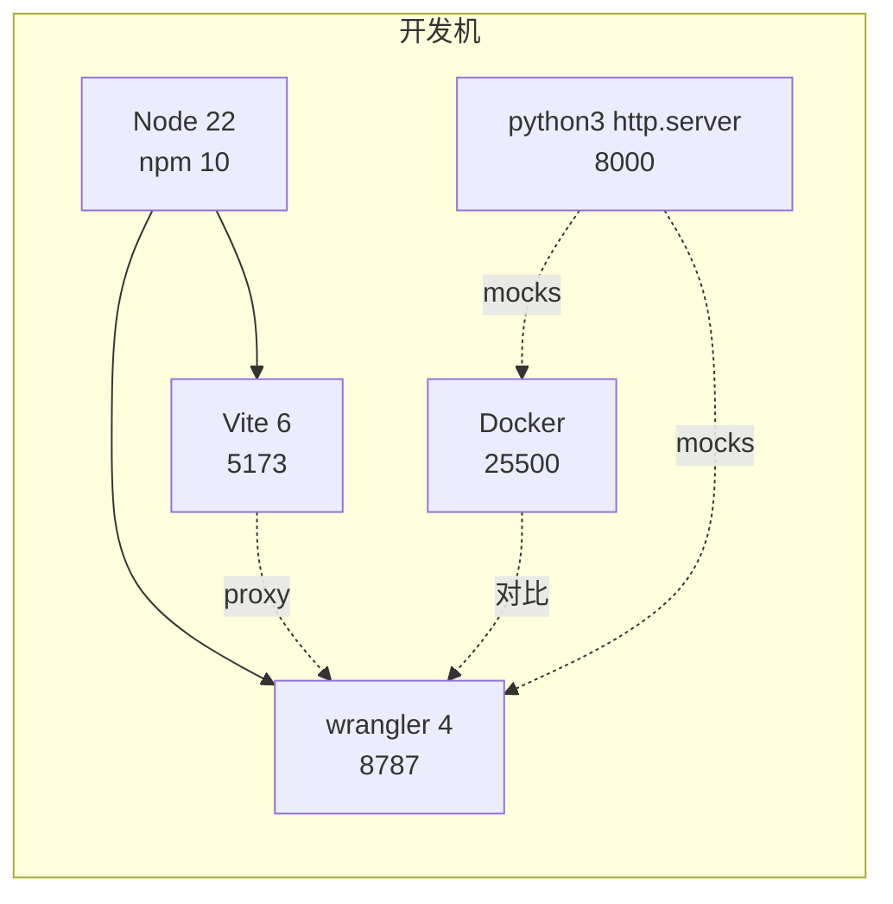
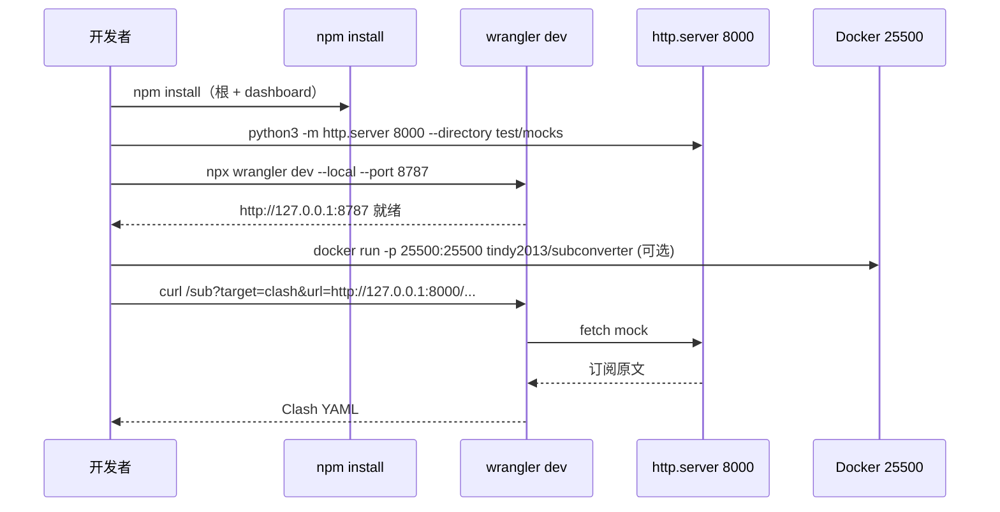
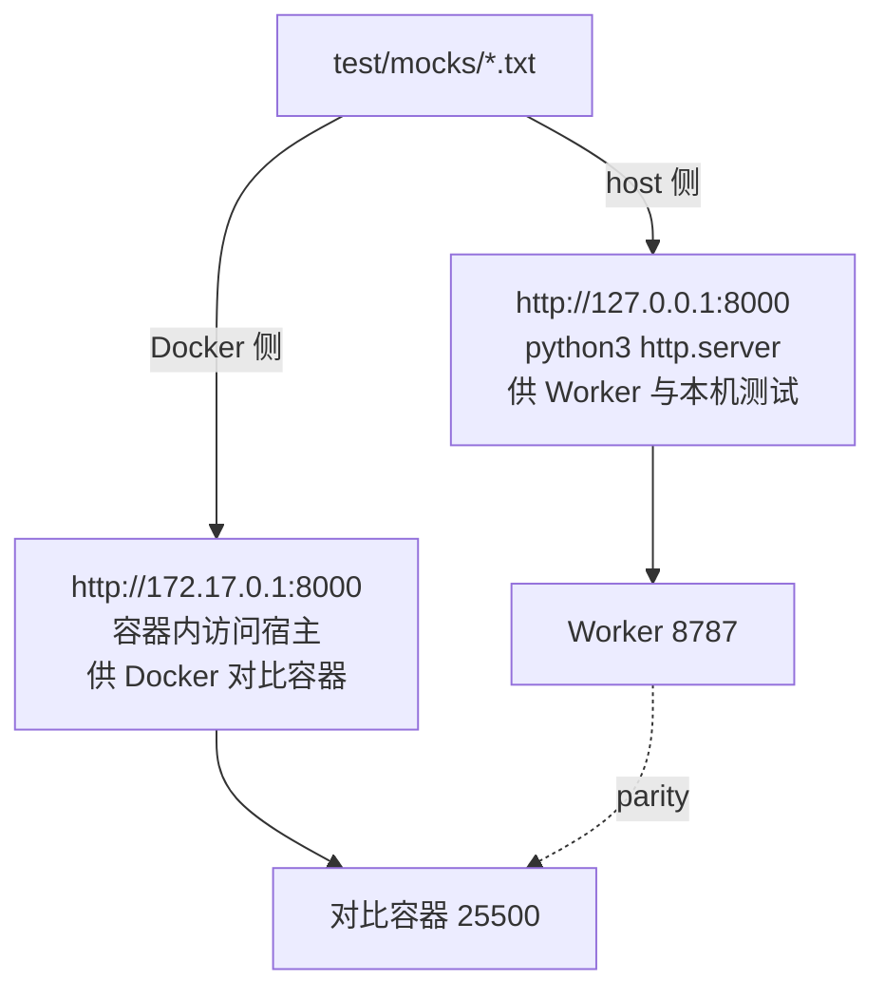
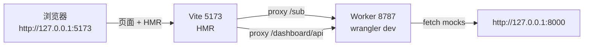

# 开发指南 — subconverter-ts

> **仓库** `subconverter-ts/` · **主分支** `master`（TS Worker）· **备份** `backup/master` / `backup/cpp-legacy`
> **Node** `22` · **wrangler** `4.126` · **TypeScript** `5.6` · **Vite** `6` · **Vitest** `3`
> 本文面向贡献者与维护者，涵盖环境、启动、脚本、Mock、Dashboard 与编码约定。规范事实以 `spec.md` 与 `src/types.ts` 为准。

---

## 目录

1. [先决条件](#1-先决条件)
2. [仓库结构](#2-仓库结构)
3. [快速开始](#3-快速开始)
4. [脚本与工具链](#4-脚本与工具链)
5. [Mock 系统](#5-mock-系统)
6. [Dashboard 开发](#6-dashboard-开发)
7. [编码约定](#7-编码约定)
8. [调试与排障](#8-调试与排障)
9. [分支与提交](#9-分支与提交)
10. [附录](#10-附录)

---

## 1. 先决条件

### 1.1 版本要求

| 工具 | 版本 | 说明 | 校验 |
|------|------|------|------|
| Node.js | `22.x`（实测 `22.19.0`） | `wrangler 4` 与 `Vite 6` 均要求 `>=18`，本仓锁定 `22` | `node -v` |
| npm | `10+`（随 Node 22） | 锁文件 `package-lock.json` | `npm -v` |
| wrangler | `^4.126.0` | Cloudflare Workers CLI，`compatibility_date 2024-01-01` + `nodejs_compat` | `npx wrangler --version` |
| Docker | 任意可用 | 仅端到端对比需要，运行 `tindy2013/subconverter` 镜像 | `docker --version` |
| Python | `3.x` | 仅用于 `python3 -m http.server` 承载 `test/mocks` | `python3 --version` |

### 1.2 依赖总览

| 依赖 | 归属 | 用途 | 可否移除 |
|------|------|------|----------|
| `js-yaml` `^4.1.0` | `dependencies` | Clash YAML 解析 | 否 |
| `spark-md5` `^3.0.2` | `dependencies` | MD5 摘要 | 否 |
| `typescript` `^5.6.3` | `devDependencies` | 类型检查 | 否 |
| `wrangler` `^4.126.0` | `devDependencies` | 本地模拟与部署 | 否 |
| `@cloudflare/workers-types` | `devDependencies` | Worker 类型 | 否 |
| `vitest` `^3.0.0` | `devDependencies` | 单元测试 | 否 |
| `eslint` + `@typescript-eslint/*` | `devDependencies` | 静态检查 | 否 |
| Dashboard 侧 `react` `react-router-dom` `zustand` `react-query` `recharts` 等 | `dashboard/package.json` | SPA 运行时 | 否 |



### 1.3 兼容性标记

`wrangler.toml` 关键配置：

```toml
compatibility_date = "2024-01-01"
compatibility_flags = ["nodejs_compat"]
```

- `nodejs_compat` 启用 `Buffer`、`process` 等 Node 兼容垫片，`src/utils/base64.ts` 等可直接使用 `Buffer`。
- `observability.enabled = true` 开启 Workers 可观测性，日志与指标进入 Cloudflare 控制台。

---

## 2. 仓库结构

```
.
├── wrangler.toml               # Worker 配置（name/main/vars/KV/D1/assets/observability）
├── schema.sql                  # D1 建表（logs + retention_log）
├── tsconfig.json               # 严格模式，bundler 解析，noEmit
├── package.json                # 根脚本（dev/build/lint/typecheck/test/deploy）
├── .eslintrc.cjs               # 放宽 no-empty / ban-ts-comment 等
├── spec.md                     # 唯一事实来源（SSOT）
├── README.md                   # 面向用户的功能与 API 文档
├── AGENTS.md                   # 协作契约（分支/事实来源/工具链）
├── src/
│   ├── index.ts                # 入口：fetch/scheduled 路由与 7 步管线
│   ├── types.ts                # 领域类型（Proxy/Settings/ExtraSettings/...）
│   ├── handler/
│   │   ├── webget.ts           # fetch + Map 缓存 + data: URI
│   │   ├── settings.ts         # buildSettings / parseIniPref / loadExternalConfig
│   │   └── dashboard.ts        # allowlist/auth/KV/D1 管控 API
│   ├── parser/
│   │   ├── subparser.ts        # 全部协议与嗅探链（explodeSub）
│   │   └── infoparser.ts       # 流量信息提取
│   ├── pipeline/
│   │   ├── filter.ts
│   │   └── nodemanip.ts
│   ├── generator/
│   │   ├── subexport.ts        # 13 目标渲染
│   │   └── ruleconvert.ts
│   ├── utils/
│   │   ├── base64.ts
│   │   ├── md5.ts
│   │   ├── regexp.ts           # regFind/regMatch/regReplace/regValid
│   │   ├── tribool.ts          # 三态布尔
│   │   ├── ini_reader.ts       # IniReader
│   │   ├── network.ts
│   │   ├── string.ts
│   │   ├── urlencode.ts
│   │   └── logger.ts
│   └── assets/base/all_base.tpl
├── dashboard/
│   ├── package.json            # SPA 独立依赖与脚本
│   ├── vite.config.ts          # alias @, outDir ../assets/dashboard, proxy
│   ├── tailwind.config.ts
│   ├── index.html
│   └── src/
│       ├── main.tsx
│       ├── App.tsx             # 路由与鉴权守卫
│       ├── components/
│       │   ├── Layout.tsx
│       │   └── ui/             # shadcn 风格组件
│       ├── lib/
│       │   ├── auth.ts         # TOKEN_KEY + getToken/setToken/isAuthenticated
│       │   └── utils.ts        # cn()
│       └── pages/              # Auth/Generate/Domains/Acl/Limits/Logs/Cache/Config/Debug
├── assets/dashboard/           # dashboard 构建输出（ASSETS 绑定目录）
├── test/
│   ├── mocks/                  # 12 订阅样例 + generate.mjs
│   ├── unit.test.ts            # vitest 单元（20）
│   ├── run-final.mjs           # 端到端 57 项（直接链 + http mocks + 远端 + parity）
│   ├── run-all.mjs
│   ├── run-http.mjs
│   └── REPORT.md               # 已知差异与对比结论
└── docs/
    ├── architecture.md
    ├── development.md          # 本文
    └── deployment.md
```

---

## 3. 快速开始

### 3.1 安装

```bash
git clone https://github.com/CtelSpecu/subconverter-ts.git
cd subconverter-ts
npm install
```

Dashboard 为独立 `npm` 上下文，如需开发 SPA：

```bash
cd dashboard
npm install
cd ..
```

### 3.2 本地启动（最小）

```bash
# 类型检查
npx tsc --noEmit

# 启动 Worker（默认 http://127.0.0.1:8787）
npx wrangler dev --local
# 或
npm run dev

# 验证
curl http://127.0.0.1:8787/version   # v0.9.0
curl -G "http://127.0.0.1:8787/sub" \
  --data-urlencode "target=clash" \
  --data-urlencode "url=ss://YWVzLTI1Ni1nY206cGFzc3dvcmQ@1.2.3.4:443#Test"
```

### 3.3 本地启动（完整端到端）

完整端到端需同时启动 Mock 静态服务与 Worker，可选启动对比用容器。

```bash
# 终端 1：Mock 静态服务（test/mocks → http://127.0.0.1:8000）
python3 -m http.server 8000 --directory test/mocks &
# 验证
curl http://127.0.0.1:8000/mixed-basic.txt | head

# 终端 2：Worker
npx wrangler dev --local --port 8787

# 终端 3（可选）：对比容器
docker run -d --name subconverter-cpp -p 25500:25500 tindy2013/subconverter:latest
curl http://127.0.0.1:25500/version

# 端到端套件
node test/run-final.mjs   # 预期 57/57
```

端口占用时：

```bash
lsof -i :8787 -sTCP:LISTEN -n -P
lsof -i :8000 -sTCP:LISTEN -n -P
# 或
ss -lptn 'sport = :8787'
```

### 3.4 环境变量

`wrangler dev` 会读取 `wrangler.toml` 的 `[vars]` 与本地 `.dev.vars`（如存在）：

```ini
# .dev.vars（本地，未提交）
API_TOKEN=local-dev-token
DEFAULT_URL=
```

`API_TOKEN` 等敏感项不要写入 `wrangler.toml` 的 `vars`，本地开发亦建议走 `.dev.vars` 或 `wrangler secret put` 的本地模拟。



---

## 4. 脚本与工具链

### 4.1 根 `package.json` 脚本

| 脚本 | 命令 | 用途 | 成功标志 |
|------|------|------|----------|
| `dev` | `wrangler dev` | 本地 Worker，默认 `8787`，监听 `src/` 变更热重载 | 终端提示 `Ready on http://127.0.0.1:8787` |
| `build` | `tsc --noEmit` | 类型检查（无产物） | 退出码 `0`，无报错 |
| `typecheck` | `tsc --noEmit` | 同 `build`，语义别名 | 同上 |
| `lint` | `eslint src --ext .ts` | 静态检查 | 退出码 `0` |
| `test` | `vitest run` | 单元测试（20） | `20/20` |
| `deploy` | `wrangler deploy` | 部署至 `churnie.workers.dev` | 见部署文档 |

常用组合：

```bash
npx tsc --noEmit && npx eslint src --ext .ts && npx vitest run
# 或
npm run build && npm run lint && npm test
```

### 4.2 单项详解

#### `tsc --noEmit`

`tsconfig.json` 要点：

```json
{
  "compilerOptions": {
    "target": "ES2022",
    "module": "ESNext",
    "moduleResolution": "bundler",
    "strict": true,
    "noEmit": true,
    "isolatedModules": true,
    "types": ["@cloudflare/workers-types"]
  }
}
```

- `noEmit` 仅检查，不产生 `dist/`。
- `strict` 禁止隐式 `any`，`src/types.ts` 为类型事实，新增字段需同步更新类型与 `spec.md`。
- 常见报错：`Cannot find module 'js-yaml'` → 确认 `npm install` 已执行；`Property 'DB_LOGS' does not exist on type 'Env'` → 扩展 `Env` 或使用 `DashboardEnv`。

#### `eslint`

`.eslintrc.cjs` 已放宽：

```js
rules: {
  '@typescript-eslint/no-explicit-any': 'off',
  '@typescript-eslint/no-unused-vars': 'off',
  '@typescript-eslint/ban-ts-comment': 'off',
  'no-empty': 'off',
  'no-inner-declarations': 'off',
  'prefer-const': 'off',
}
```

执行：

```bash
npx eslint src --ext .ts
npx eslint src --ext .ts --fix   # 自动修复可修复项
```

#### `vitest`

```bash
npx vitest run                 # 单次
npx vitest run --reporter=verbose
npx vitest watch               # 监听
npx vitest run test/unit.test.ts
```

覆盖率（如需）：

```bash
npx vitest run --coverage
```

#### `test/run-final.mjs`

端到端 57 项，覆盖 4 段：直接链（无 http）、TS 本地 http、远端 curl、parity 对比。

```bash
# 前置：python3 -m http.server 8000 --directory test/mocks &
#      npx wrangler dev --local --port 8787 &
#      docker run -d -p 25500:25500 tindy2013/subconverter:latest (可选)

node test/run-final.mjs
# 预期：=== Summary: 57/57 passed, 0 failed ===

# 仅 http 段
node test/run-http.mjs

# 全量（含性能）
node test/run-all.mjs
```

远端段通过 `curl` 绕过 `http_proxy`，`status 0` 视为 `WARNING` 非失败，适配无外网 CI。

| 段 | 源 | 目标 | 数量 |
|----|----|------|------|
| 直接链 | `ss://` 等直链 `\|` 拼接 | `clash/clashr/surge/ss/mixed` 等 | ~15 |
| TS 本地 http | `http://127.0.0.1:8000/*.txt` | 13 目标 + `include/exclude` + `large` | ~19 |
| 远端 curl | `https://subconverter-worker.churnie.workers.dev` | 同上（网络可达时） | ~6 |
| Parity | 直链结果逐字节对比 | 本地 vs 对比容器 | 2 |

---

## 5. Mock 系统

### 5.1 文件清单

`test/mocks/` 共 12 个订阅样例 + `generate.mjs`：

| 文件 | 节点数 | 协议/格式 | 说明 |
|------|--------|-----------|------|
| `mixed-basic.txt` | 5 | 混合直链 | 基础混合，无 `http://` 行 |
| `mixed-large.txt` | 20 | 混合直链 | 压力测试 |
| `mixed-basic.b64` | 5 | base64 | 同 `mixed-basic.txt` 的 base64 形态 |
| `ss-only.txt` | 1 | `ss://` | SIP002 单源 |
| `ssr-only.txt` | 1 | `ssr://` | SSR 单源 |
| `vmess-only.txt` | 1 | `vmess://` | 标准 VMess 图 |
| `trojan-only.txt` | 1 | `trojan://` | Trojan 单源 |
| `hy2-only.txt` | 1 | `hy2://` | Hysteria2 单源 |
| `anytls-only.txt` | 1 | `anytls://` | AnyTLS 单源 |
| `socks-http-only.txt` | 1 | `socks`/`http` | Socks/Http 单源 |
| `clash.yaml` | — | Clash YAML | `proxies:` 列表 |
| `clash.b64` | — | base64 Clash | 同上 base64 |
| `surge.ini` | — | Surge INI | `Proxy` 段 |
| `empty.txt` | 0 | 空 | 边界 |
| `invalid.txt` | 0 | 非法 | 边界 |
| `generate.mjs` | — | 脚本 | 重建全部 mocks |

> 计数以 `generate.mjs` 为准，12 为核心订阅文件，含 `empty`/`invalid` 则 14，文档以 12 指代核心协议覆盖。

### 5.2 双 Host 约束



- `127.0.0.1:8000` 为宿主机视角，供 `wrangler dev` 与 `run-final.mjs` 的 http 段。
- `172.17.0.1:8000` 为容器视角（`172.17.0.1` 为 Docker 默认网桥网关），供容器内访问宿主 mocks。新增 mock 时需验证双 host 均可达。
- `mixed-basic.txt` 刻意不含 `http://` 行，避免触发某些环境的外部探测超时。

### 5.3 生成与校验

```bash
node test/mocks/generate.mjs   # 重建全部样例
cat test/mocks/mixed-basic.txt
base64 -w0 test/mocks/mixed-basic.txt | head -c 80
```

新增协议时同步更新：

1. `test/mocks/generate.mjs` 的样例列表
2. `test/run-final.mjs` 的 `targets` 数组
3. `test/unit.test.ts` 的单协议用例
4. `spec.md` 与 `docs/architecture.md` 的矩阵

---

## 6. Dashboard 开发

### 6.1 技术栈

| 层 | 选型 | 版本 |
|----|------|------|
| 框架 | `react` | `^18.3.1` |
| 路由 | `react-router-dom` | `^6.26.2` |
| 状态 | `zustand` | `^4.5.5` |
| 服务端状态 | `@tanstack/react-query` | `^5.60.0` |
| 样式 | `tailwindcss` `tailwind-merge` `clsx` `class-variance-authority` | `3.x / 2.x` |
| 图标 | `lucide-react` | `^0.460.0` |
| 表单 | `react-hook-form` `zod` `@hookform/resolvers` | `7.x / 3.x` |
| 图表 | `recharts` | `^2.12.7` |
| 构建 | `vite` `@vitejs/plugin-react` | `^6.0.5` |

### 6.2 本地开发

```bash
cd dashboard
npm install
npm run dev    # http://127.0.0.1:5173
```

`dashboard/vite.config.ts` 关键配置：

```ts
export default defineConfig({
  plugins: [react()],
  resolve: { alias: { "@": path.resolve(__dirname, "./src") } },
  build: { outDir: "../assets/dashboard", emptyOutDir: true },
  server: {
    port: 5173,
    proxy: {
      "/sub": "http://localhost:8787",
      "/dashboard/api": "http://localhost:8787",
    },
  },
});
```



- 前端所有 `/sub` 与 `/dashboard/api` 请求由 Vite 代理至 Worker，避免 CORS。
- Worker 需单独启动：`npx wrangler dev --local --port 8787`。
- 鉴权：`dashboard/src/lib/auth.ts` 的 `TOKEN_KEY = "dashboard_token"` 存 `localStorage`，`authHeader()` 注入 `Authorization: Bearer`。

### 6.3 构建与预览

```bash
cd dashboard
npm run build      # 输出至 ../assets/dashboard（被 wrangler 作为 ASSETS 发布）
npm run preview    # 预览构建产物
npm run typecheck  # tsc --noEmit
```

| 命令 | 输出 | 说明 |
|------|------|------|
| `vite build` | `assets/dashboard/` | `emptyOutDir: true` 清空后写入，`index.html` + `assets/*` |
| `vite preview` | 本地静态预览 | 默认 `4173`，不走 Worker |
| `wrangler dev` | 读取 `assets/dashboard` | `assets.directory = "./assets/dashboard"`，`single-page-application` 回退 |

构建后需验证：

```bash
ls -lh assets/dashboard/
cat assets/dashboard/index.html | head -n 20
npx wrangler dev --local --port 8787 &
curl -s http://127.0.0.1:8787/dashboard/ | head -n 20
```

### 6.4 页面与路由

| 路径 | 文件 | 职责 |
|------|------|------|
| `/dashboard/auth` | `pages/Auth.tsx` | 登录，`setToken` |
| `/dashboard/generate` | `pages/Generate.tsx` | 订阅生成器，拼装 `/sub` 链接 |
| `/dashboard/domains` | `pages/Domains.tsx` | 域名白名单 |
| `/dashboard/acl` | `pages/Acl.tsx` | ACL 黑白名单（`ip/domain/ua/remark`） |
| `/dashboard/limits` | `pages/Limits.tsx` | 限流阈值 |
| `/dashboard/logs` | `pages/Logs.tsx` | 日志分页 + retention 设置 + 图表 |
| `/dashboard/cache` | `pages/Cache.tsx` | 缓存查看/刷新/清空 |
| `/dashboard/config` | `pages/Config.tsx` | 偏好配置 |
| `/dashboard/debug` | `pages/Debug.tsx` | 粘贴订阅即时解析预览 |

鉴权守卫见 `dashboard/src/App.tsx` 的 `RequireAuth`，未登录重定向至 `/dashboard/auth`。

---

## 7. 编码约定

### 7.1 总则

- **类型优先**：`src/types.ts` 为类型事实，`Proxy` 等核心类型变更需同步 `spec.md`。
- **契约先行**：改 `7 步管线` 顺序、`applyMatcher` 前缀、`regFind` 语义需先更新 `spec.md` 并评审。
- **优雅降级**：外部 `fetch` 失败不抛至上层，单行解析失败静默丢弃，避免整批失败。
- **无文件系统**：不引入 `fs` 读取本地文件，外部配置仅走 `fetch`。

### 7.2 三态布尔 `tribool`

`src/utils/tribool.ts` 实现三态 `Tribool = boolean | undefined`，`undefined` 表示 `undef`（未指定）。

| 函数 | 语义 | 示例 |
|------|------|------|
| `parseTribool(val)` | `"" / undefined → undef`，`"true"/"1" → true`，`"false"/"0" → false`，其他 → `undef` | `parseTribool("TRUE") === true` |
| `triboolDefine(a, b)` | `a` 已定义则取 `a`，否则取 `b`（优先级链） | `triboolDefine(param, global)` |
| `triboolGet(val, def)` | `undef` 时回退 `def` | `triboolGet(val, false)` |
| `TriboolWrapper` | 面向对象封装，支持链式 `define` | `new TriboolWrapper(x).define(y).get(def)` |

使用场景：`emoji`/`append_type`/`tfo`/`udp`/`scv`/`fdn`/`sort`/`expand`/`classic`/`append_info`/`list` 等 11 个参数，优先级为 `query 参数 > 全局 Settings > 默认 false`。

```ts
// src/index.ts 典型用法
const appendInfo = appendInfoRaw.toLowerCase();
const shouldAppend = appendInfo === ''
  ? settings.appendUserinfo
  : appendInfo === 'true' || appendInfo === '1';
```

### 7.3 正则 `regexp`

`src/utils/regexp.ts` 以 JS `RegExp` 对齐原 `jpcre2` 语义，全部调用永不抛错：

| 函数 | 对应语义 | 实现 | 失败 |
|------|----------|------|------|
| `regFind(pattern, text)` | 部分匹配 | `new RegExp(pattern).test(text)` | `false` |
| `regMatch(pattern, text)` | 全字匹配 | `new RegExp(`^(?:${pattern})$`, 'u').test(text)` | `false` |
| `regReplace(pattern, replacement, text)` | 全局替换 | `text.replace(new RegExp(pattern, 'g'), replacement)` | 原串 |
| `regValid(pattern)` | 编译校验 | `try { new RegExp(pattern) }` | `false` |

> 注意：`PCRE2` 的 `*SKIP/*FAIL/\K/递归/ALT_BSUX` 等高级特性不模拟，依赖 `filter/rename/emoji` 的黄金文件回归覆盖。

`include`/`exclude` 使用 `regFind`，逐段 `|`/`\`` 分割后校验：

```ts
for (const pat of include.split(/[|`]/)) {
  if (pat.trim() && !isValidRegex(pat.trim())) return { body: 'Invalid include regex!', status: 400 };
}
```

### 7.4 INI 解析 `ini_reader`

`src/utils/ini_reader.ts` 的 `IniReader` 支持：

| 选项 | 含义 |
|------|------|
| `allowDupSectionTitles` | 允许重复段名（合并） |
| `storeAnyLine` | 无 `=` 行也存入（Surge `Proxy` 行） |
| `storeIsolatedLine` | 孤立行存入指定段 |
| `isolatedSection` | 孤立行归属段名 |
| `keepEmptySection` | 保留空段 |

关键行为：

- `processEscape` 将 `\n/\r/\t` 转义还原。
- `get(section, key, def)` 取首值，`getAll(section, key)` 取全量。
- `getBool` 识别 `true/false/1/0/yes/no/on/off`。
- 注释行 `;`/`#` 与空行跳过，`[section]` 识别段。

Surge 解析使用 `storeAnyLine: true` 以保留 `Proxy = ...` 等行。

### 7.5 其他约定

| 约定 | 说明 |
|------|------|
| `Proxy` 结构 | `type/hostname/port/password/method/.../group/groupId/id/remark`，`groupId` 负值表示 `insert` 源 |
| `extractFetchUrl` | 去 `tag:` 前缀，`data:` 直通 |
| `isDirectProxyLink` | `ss://` 等非 `http/https/data` 直通不 `fetch` |
| `subRequestLimit` | `50`，超限截断 |
| `request.url.length` | `>16384` → `414` |
| 响应头 | `Subscription-Userinfo` 透传；`profile-update-interval` 仅 `clash/clashr`；`Content-Disposition` 仅 `filename` 非空 |

---

## 8. 调试与排障

### 8.1 常用命令

```bash
# 查看 Worker 日志（wrangler dev 终端）
npx wrangler dev --local --port 8787 --log-level debug

# 调试解析（无需鉴权，直连 Worker 的 debug 接口）
curl -X POST http://127.0.0.1:8787/dashboard/api/debug \
  -H "Authorization: Bearer $API_TOKEN" \
  -H "Content-Type: application/json" \
  -d '{"link":"ss://YWVzLTI1Ni1nY206cGFzc3dvcmQ@1.2.3.4:443#Test"}' | jq

# 查看 KV（需 wrangler 登录）
npx wrangler kv key list --binding ADMIN
npx wrangler kv key get --binding ADMIN "domains"

# 查看 D1
npx wrangler d1 execute subconverter-logs --command "SELECT count(*) FROM logs"
```

### 8.2 常见问题

| 现象 | 原因 | 解决 |
|------|------|------|
| `Invalid target!` | `target` 非 `ALLOWED_TARGETS` | 检查 `target` 拼写，`auto` 会按 UA 归一 |
| `Invalid include regex!` | `include` 含非法正则 | `regValid` 逐段校验，修正或移除 |
| `URI Too Long` | `url` 长度 `>16384` | 减少多源数量或改用 `data:` 分片 |
| `Loop detected` | 请求含 `SubConverter-Request` 头 | 移除该头，仅内部防护 |
| `403 Forbidden` | allowlist 阻断 | 检查 `KV ADMIN` 的 `domains`/`acl` 与 `acl:enabled` |
| `401 Unauthorized` | `Bearer` 不匹配 | `localStorage.dashboard_token` 与 `API_TOKEN` 一致 |
| `fetch failed / AbortError` | 上游超时或 `http_proxy` 干扰 | `curl --noproxy '*'` 或检查 `AbortSignal 8s` |
| `data:` 返回空 | `data:` 格式错误 | 需 `data:[<mediatype>][;base64],<data>`，逗号分隔 |
| Vite 代理 `ECONNREFUSED` | Worker 未启动 | 先 `npx wrangler dev --port 8787` |

### 8.3 日志与追踪

- Worker 日志：`wrangler dev` 终端与 `observability.enabled` 后的 Cloudflare 控制台。
- 审计日志：`D1` 的 `logs` 表，脱敏存储，不含订阅原文。
- 前端：浏览器 DevTools Network 面板查看 `proxy` 是否命中 `8787`。

---

## 9. 分支与提交

### 9.1 分支

| 分支 | 指向 | 说明 |
|------|------|------|
| `master` | TS Worker | 主分支，当前交付 |
| `feat/workers-migration` | 同 `master` | 历史分支，保留 |
| `backup/master` | `a0d4eab` | 原始备份，永不 force |
| `backup/cpp-legacy` | `a0d4eab` | 同上 |

禁止直接 `git push --force` 覆盖备份分支；需回滚主分支：

```bash
git push origin backup/master:master --force
```

### 9.2 提交

格式 `feat/fix/test/docs` 前缀 + Lore 风格正文：

```
feat(subparser): 支持 anytls 单链解析

Constraint: 新增 ProxyType AnyTLS
Rejected: 兼容旧版 anytls 字段缺失时抛错（改为静默丢弃）
Tested: npx vitest run 20/20, node test/run-final.mjs 57/57
```

推送前必跑：

```bash
npx tsc --noEmit && npx eslint src --ext .ts && npx vitest run && timeout 90 node test/run-final.mjs
```

---

## 10. 附录

### 10.1 端口速查

| 端口 | 进程 | 用途 |
|------|------|------|
| `8787` | `wrangler dev` | Worker 本地 |
| `5173` | `vite dev` | Dashboard 开发 |
| `8000` | `python3 http.server` | Mocks 静态 |
| `25500` | `Docker subconverter` | 对比容器 |

### 10.2 关键文件索引

| 文件 | 说明 |
|------|------|
| `src/index.ts` | 路由与管线 |
| `src/types.ts` | 类型事实 |
| `src/handler/webget.ts` | 拉取与缓存 |
| `src/handler/settings.ts` | 配置合并 |
| `src/handler/dashboard.ts` | 管控 API |
| `src/parser/subparser.ts` | 协议解析 |
| `src/utils/regexp.ts` | 正则适配 |
| `src/utils/tribool.ts` | 三态布尔 |
| `src/utils/ini_reader.ts` | INI 解析 |
| `dashboard/src/App.tsx` | 前端路由 |
| `dashboard/vite.config.ts` | 前端构建与代理 |
| `wrangler.toml` | Worker 配置 |
| `schema.sql` | D1 建表 |
| `test/mocks/generate.mjs` | Mock 生成 |
| `test/run-final.mjs` | 端到端套件 |

---

> 新增协议或目标时，按 §5.3 与 §6.4 的清单同步更新 mocks、targets、单元与文档。
