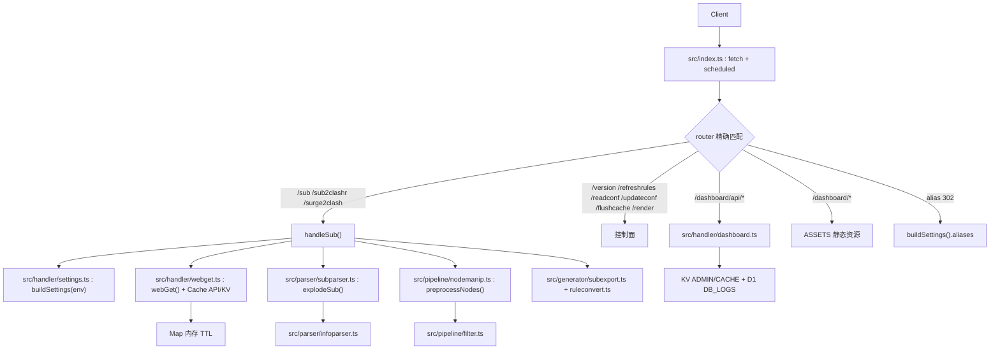
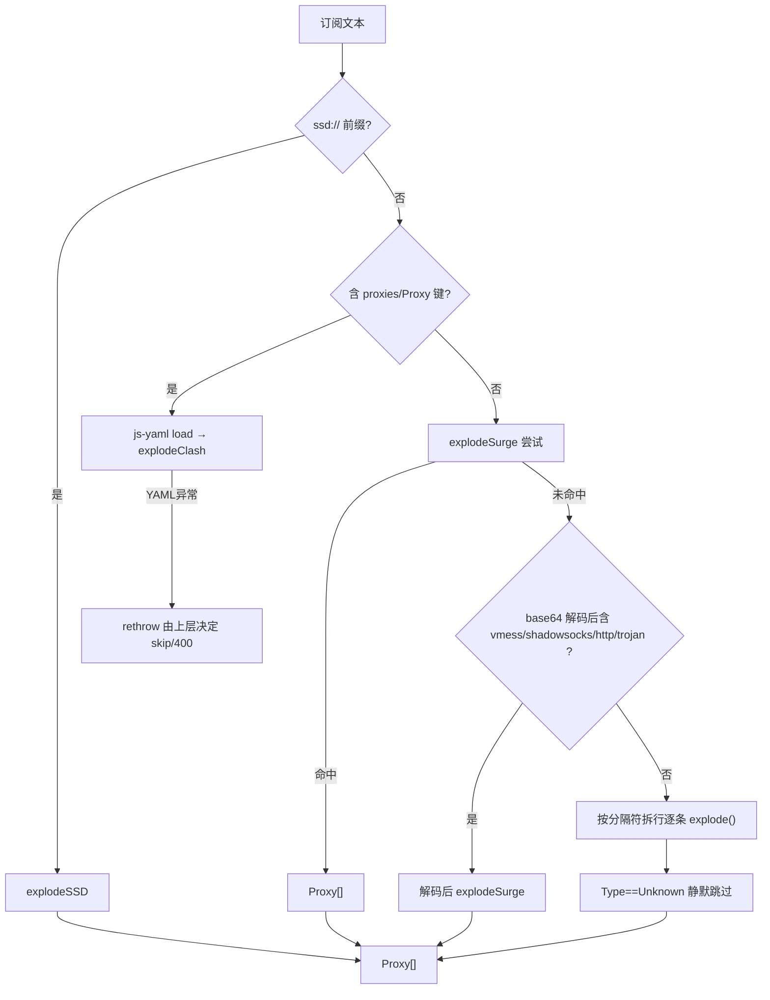
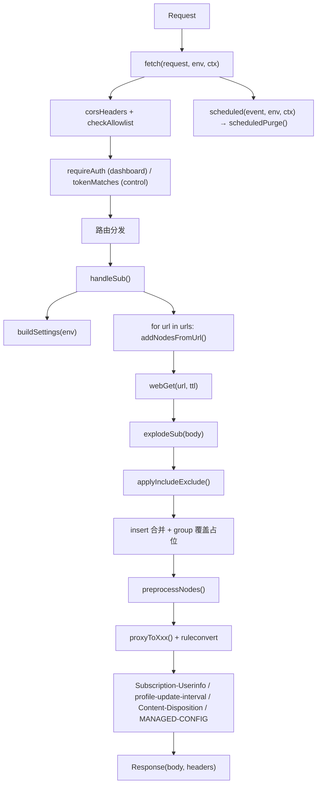

# subconverter-ts TypeScript Workers 规范

> **Project** `subconverter-ts/` · **Source** tindy2013/subconverter `v0.9.0` 迁移
> **Stack** TypeScript + Cloudflare Workers (Modules, `wrangler` 4.x) · **Entry** `src/index.ts`
> **Dashboard** `dashboard/` 9 页面 · **Worker** `src/` · **Audit time** 2026-08-27
> 本文档是 **TypeScript 实现的唯一事实来源**。C++ 审计原文归档于 `docs/spec-cpp.md`；与代码不一致时以 `src/` 源码为准。

---

## 目录

1. [项目概述与范围](#1-项目概述与范围)
2. [架构总览](#2-架构总览)
3. [HTTP API 契约](#3-http-api-契约)
4. [核心数据模型](#4-核心数据模型)
5. [订阅解析](#5-订阅解析)
6. [流量/到期信息提取](#6-流量到期信息提取)
7. [转换管线（顺序是契约）](#7-转换管线顺序是契约)
8. [输出目标矩阵](#8-输出目标矩阵)
9. [代理组规则匹配语义](#9-代理组规则匹配语义)
10. [规则与规则集系统](#10-规则与规则集系统)
11. [Clash YAML 细节](#11-clash-yaml-细节)
12. [Surge / Surfboard / Loon / Quan(X) / Mellow / SingBox 细节](#12-surge-surfboard-loon-quanx-mellow-singbox-细节)
13. [配置系统](#13-配置系统)
14. [INIReader 语义（TS 版）](#14-inireader-语义ts-版)
15. [模板引擎](#15-模板引擎)
16. [脚本与定时任务](#16-脚本与定时任务)
17. [网络、缓存与上传](#17-网络缓存与上传)
18. [已识别行为与静默处理](#18-已识别行为与静默处理)
19. [Cloudflare Workers 运行环境约束（实际实现）](#19-cloudflare-workers-运行环境约束实际实现)
20. [迁移架构设计（实际实现）](#20-迁移架构设计实际实现)
21. [模块映射与可移植性矩阵](#21-模块映射与可移植性矩阵)
22. [兼容性风险清单](#22-兼容性风险清单)
23. [TS 项目骨架与技术选型](#23-ts-项目骨架与技术选型)
24. [行为等价策略（黄金文件）](#24-行为等价策略黄金文件)
25. [安全与操控面](#25-安全与操控面)
26. [分阶段实施计划](#26-分阶段实施计划)
27. [端到端验证清单](#27-端到端验证清单)
28. [附录：配置键速查 · 路由状态码 · 关键常量](#28-附录)

---

## 1. 项目概述与范围

- 入口：`src/index.ts`，版本常量 `VERSION = 'v0.9.0'`，`SERVER_HEADER = 'subconverter/v0.9.0 cURL/8.0'`。
- 技术栈：**TypeScript**，依赖 `js-yaml` / `spark-md5`，运行时为 Cloudflare Workers `fetch` + `scheduled`，模块格式 `type = "module"`。
- 功能本质：**订阅转换器**——将任意来源的代理节点订阅（SS/SSR/VMess/Trojan/Hysteria2/AnyTLS/SOCKS/HTTP 以及 Clash YAML、Surge INI、Quantumult 行内格式的混合文本）转换为 13+ 目标客户端配置（Clash/Surge/Surfboard/Mellow/SSSub/单链接/Quantumult/QuanX/Loon/SSD/SingBox 等），支持远程规则集、自定义代理组、节点过滤/重命名/emoji/排序、`data:` 内联、批量 `|` 分隔订阅、Managed Config、别名重定向、Dashboard 运维面。
- 部署形态：单一 Worker `subconverter-worker`，`wrangler.toml` 声明 `CACHE` / `ADMIN` KV 与 `DB_LOGS` D1，静态资源 `assets/dashboard` 通过 `ASSETS` 绑定提供 SPA。
- 与 C++ 版的差异已归档：`docs/spec-cpp.md` 保留完整的 C++ 文件行号审计链，本规范仅描述 TS 实现的契约与行为；不再依赖 `libcurl / yaml-cpp / PCRE2 / QuickJS / RapidJSON / toml11 / cpp-httplib`。

---

## 2. 架构总览



- **无全局单例**：每请求由 `buildSettings(env)` 物化 `Settings`，不使用 RWLock；`env` 来自 `wrangler.toml [vars]` 与 `secret`。
- **全异步**：`webGet` 基于 `fetch` + `AbortSignal.timeout(15000)`，跟随重定向至多 20 跳；`data:` URI 由 `parseDataUri()` 内联解码，不走网络。
- **模块划分**：`parser/` 负责订阅文本到 `Proxy[]`；`pipeline/` 负责过滤/重命名/emoji/排序/组匹配；`generator/` 负责各目标的文本渲染；`handler/` 负责设置与网络；`utils/` 负责基础能力。

---

## 3. HTTP API 契约

### 3.1 路由表（`src/index.ts` 精确注册）

| Method | Path | Content-Type | Handler | 说明 |
|--------|------|--------------|---------|------|
| GET | `/` | text/plain | inline | 健康检查，返回空串 |
| GET | `/version` | text/plain | inline | 返回 `VERSION` |
| GET | `/refreshrules` | text/plain | lambda | token 校验（非空才比对），返回 `Rules refreshed` |
| GET | `/readconf` | text/plain | lambda | token 校验（非空才比对），MVP 返回空串 |
| POST | `/updateconf` | text/plain | lambda | token 校验；消费 `request.text()` 后返回 `Config updated` |
| GET | `/flushcache` | text/plain | lambda | `token` 严格比对（含空串），`flushCache()` 清内存缓存 |
| GET/HEAD | `/sub` | text/plain;charset=utf-8 | `handleSub` | 主转换 |
| GET | `/sub2clashr` | text/plain;charset=utf-8 | `handleSub` 快捷 | 强制 `target=clashr` |
| GET | `/surge2clash` | text/plain;charset=utf-8 | `handleSub` 快捷 | 若无 `target` 则设为 `clash`，按 Surge 文本解析 |
| GET | `/render` | text/plain | stub | 当前返回 404 `Not Found`（保留路径，占位） |
| GET | `alias` | 302 | `buildSettings` | `settings.aliases[path] → Location` |
| GET/POST/PUT/DELETE | `/dashboard/api/*` | application/json | `src/handler/dashboard.ts` | 需 `checkAllowlist` + `requireAuth`（除 `/auth`） |
| GET | `/dashboard/*` | MIME 自动 | `ASSETS.fetch` | SPA 回退 `index.html` |
| OPTIONS | `*` | — | CORS 预检 | 按路径聚合 `Allow-Methods` |

- 404：未命中任何路由。
- 500：处理器抛异常由顶层 `catch` 返回 `Exception: name - message`。
- 循环防护：请求头含 `SubConverter-Request` 立返 500 `Loop detected`。
- URL 长度：`requestUrl.toString().length > 16384` 返 414 `URI Too Long`（对齐原 `CPPHTTPLIB_REQUEST_URI_MAX_LENGTH`）。

### 3.2 /sub 参数手册（`src/index.ts` 的 `handleSub`）

`handleSub` 通过 `requestUrl.searchParams` 读取；`url` 支持 `|` 分隔多条，`extractFetchUrl()` 处理 `tag:name,url` 的最后逗号后 URL 与 `surge:///install-config?url=` 解包。

| 参数 | 类型 | 默认 | 说明 |
|------|------|------|------|
| `target` | enum | —（必填） | 见 §8。`auto` 时按 `User-Agent` 嗅探 `clash/surge`，缺省 `clash` |
| `url` | string | `settings.defaultUrls` | 订阅 URL，`|` 分隔；支持 `tag:name,url` 前缀、`data:` 内联、`surge:///install-config?url=` 解包、`nullnode` 占位（跳过） |
| `ver` | `2\|3\|4` | `4` | Surge 版本；`parseInt(verRaw || '4')`，影响 `proxyToSurge` 分支 |
| `config` | string | 空 | 外部配置 URL，`loadExternalConfig()` 尽力加载（MVP 忽略合并，仅触发 fetch） |
| `include` | rs | 空 | 包含正则（`\|`/` + `` ` `` 分隔），非空时任一命中才保留；非法正则整请求 400 `Invalid include regex!` |
| `exclude` | rs | 空 | 排除正则；任一命中即剔除；非法 400 `Invalid exclude regex!` |
| `groups` / `ruleset` | urlB64 | 空 | 保留参数位，MVP 未展开覆盖（与 C++ 的 Base64 组/规则覆盖语义对齐，待实现） |
| `group` | string | 空 | `|` 分隔的自定义分组名，大小写不敏感；MVP 仅解析占位，未改写 `Proxy.Group` |
| `sort` | tribool | `false` | `true/1` 时按 Remark `localeCompare` 字典序 `sort` |
| `interval` | int | `settings.configUpdateInterval` | `profile-update-interval` 小时（`/3600` 向下取整） |
| `append_info` | tribool | `settings.appendUserinfo` | 是否回传 `Subscription-Userinfo`；空串回落 `settings`，否则 `true/1` 才回传 |
| `filename` | string | 空 | `Content-Disposition: attachment; filename="…"; filename*=utf-8''<urlenc>` |
| `token` | string | — | 仅影响控制面鉴权；`/sub` 本身不鉴权，脚本门控由 `settings.authorized` 决定（见 §16） |
| `filter_script` / `rename` / `emoji` / `add_emoji` 等 | tribool/string | — | 保留参数位，MVP 仅 `sort` 生效，其余由 `src/pipeline/nodemanip.ts` 的 `preprocessNodes` 在完整实现中消费 |

- **tribool 三态**：`boolean | undefined`，`undefined` 表示未显式指定，回落 `Settings` 默认。
- **简单/复杂判定**：TS 侧不区分 `lSimpleSubscription`，统一走 `explodeSub` + 生成器分支；无规则集时不触发远程拉取。
- 缺少 `url` 且无 `insertUrls` 时 400 `Invalid url!`；`target` 非法 400 `Invalid target!`。

### 3.3 认证

| 面 | 默认 | 逻辑 |
|----|------|------|
| `API_MODE` | `true`（`wrangler.toml [vars]`） | 仅影响控制面是否校验 `token`；`false` 时 `/refreshrules` 等放行 |
| `API_TOKEN` | 空（`wrangler secret`） | `/refreshrules`、`/readconf`、`/updateconf` 仅 `expected` 非空才比对；`/flushcache` 严格比对（空串亦须相等） |
| `DASHBOARD_TOKEN` | 空 | `/dashboard/api/*`（除 `/auth`）由 `requireAuth()` 校验 `Authorization: Bearer <token>` |
| `FRONTEND_ALLOWLIST` | 空 | 为空则 `ACAO: *`；非空则按 `Origin`/`Referer` 主机精确匹配，命中返回 `ACAO: Origin + Vary: Origin`，否则 403 `blocked_by_allowlist` |
| 环境变量覆盖 | — | `API_MODE` / `API_TOKEN` / `MANAGED_PREFIX` / `DEFAULT_URL` 均来自 `Env` 绑定 |

### 3.4 响应头与 CORS

| 头 | 触发条件 | 值 | 位置 |
|----|---------|----|------|
| `Server` | 全部 | `subconverter/v0.9.0 cURL/8.0` | `corsHeaders()` |
| `Access-Control-Allow-Origin` | 全部 | `*` 或 `Origin`（allowlist 命中时） | `corsHeaders()` + `checkAllowlist()` |
| `Access-Control-Allow-Headers` | 全部/预检 | 回显 `Access-Control-Request-Headers`；默认 `Content-Type,Authorization` | `corsHeaders()` / 预检分支 |
| `Access-Control-Allow-Methods` | 预检 | 按路径聚合（见 §3.1） | 预检分支 |
| `Vary` | allowlist 命中 | `Origin` | `checkAllowlist()` |
| `Subscription-Userinfo` | 存在上游头且 `append_info` 允许 | 上游 `Subscription-Userinfo` 原样回传 | `handleSub` |
| `profile-update-interval` | `target ∈ {clash,clashr}` | `interval/3600` | `handleSub` |
| `Content-Disposition` | `filename≠∅` | `attachment; filename="…"; filename*=utf-8''<urlenc>` | `handleSub` |
| `#!MANAGED-CONFIG` | Surge/Surfboard 且 `writeManagedConfig && prefix≠∅` | 前置到响应体首行（非头） | `handleSub` 的 Surge 分支 |

- CORS 预检：`OPTIONS` 返回 200，`Allow-Methods` 按路径精确返回；Dashboard 与转换路由的预检均先过 `checkAllowlist`。
- `X-Client-IP`：TS 侧未显式回显，依赖平台 `CF-Connecting-IP`；如需可在 `corsHeaders` 扩展。

### 3.5 重定向与静态文件

- 别名重定向：`buildSettings(env).aliases[path] → 302 Location`，在 `handleSub` 之前匹配。
- 静态资源：`ASSETS` 绑定提供 `dashboard/` 构建产物；`/` 与 `/dashboard/*` 优先尝试精确资源，404 时回退 `index.html`（SPA）。
- `/get`、`/getlocal`、`serve_file_root`：**不实现**，请求将落 404。

---

## 4. 核心数据模型

### 4.1 Proxy（`src/types.ts`）

```ts
type ProxyType = 'SS' | 'SSR' | 'VMess' | 'Socks5' | 'Http' | 'Https'
  | 'Trojan' | 'Snell' | 'WireGuard' | 'Hysteria' | 'Hysteria2' | 'AnyTLS' | 'Unknown';

interface Proxy {
  type: ProxyType;
  group: string; groupId: number; id: number;
  remark: string; hostname: string; port: number;
  udp?: boolean; tfo?: boolean; scv?: boolean; tls13?: boolean;
  // SS/SSR
  method?: string; password?: string; cipher?: string;
  protocol?: string; protocolParam?: string; obfs?: string; obfsParam?: string;
  // VMess
  uuid?: string; alterId?: string; tls?: string; sni?: string; alpn?: string;
  host?: string; path?: string; net?: string; tlsSecure?: boolean;
  // Trojan / Hysteria
  sni?: string; fingerprint?: string; up?: string; down?: string; ports?: string;
  obfs?: string; obfsParam?: string; alpn?: string;
  // WireGuard / Snell / Hysteria1
  publicKey?: string; privateKey?: string; presharedKey?: string; ip?: string; ipv6?: string;
  psk?: string; version?: string;
  // Plugin
  plugin?: string; pluginOpts?: string;
  // 传输层
  underlyingProxy?: string; transferProtocol?: string; fakeType?: string;
}
```

`commonConstruct()` 统一填充 `type/group/remark/hostname/port/udp/tfo/scv/tls13`，`port` 非法回落 `443`（生成器侧），解析侧 `isValidPort` 校验 `1..65535`。

### 4.2 ProxyGroupConfig（`src/types.ts`）

```ts
type ProxyGroupType = 'Select'|'URLTest'|'Fallback'|'LoadBalance'|'Relay'|'SSID'|'Smart';
interface ProxyGroupConfig {
  name: string; type: ProxyGroupType;
  proxies: string[];          // 规则或字面量，去重由生成器负责
  usingProvider?: string[];   // !!PROVIDER=a,b
  url?: string; interval?: number; timeout?: number; tolerance?: number;
  strategy?: 'ConsistentHashing'|'RoundRobin';
  lazy?: boolean; disableUdp?: boolean; persistent?: boolean; evaluateBeforeUse?: boolean;
}
```

来源：`settings.ts` 的 `parseIniPref()` 与外部配置合并；`groupGenerate()` 按规则展开为 `remark` 列表。

### 4.3 RulesetConfig（`src/types.ts`）

```ts
interface RulesetConfig {
  group: string; url: string; interval: number;
  type: 'RULESET_SURGE'|'RULESET_QUANX'|'RULESET_CLASH_DOMAIN'|'RULESET_CLASH_IPCIDR'|'RULESET_CLASH_CLASSICAL';
}
```

URL 前缀 `clash-domain:/clash-ipcidr:/clash-classic:/quanx:/surge:` 决定 `type`；`[]` 内联规则以 `[]` 前缀存储。

### 4.4 RegexMatchConfig（`src/types.ts`）

```ts
interface RegexMatchConfig { match: string; replace: string; script?: string; }
```

对应 `rename_node` 与 `emoji` 的正則替换；`match` 为 `RegExp` 源码，`replace` 为替换模板。

### 4.5 ExtraSettings（`src/types.ts`）

`ExtraSettings` 为生成器选项：`enableRuleGenerator/overwriteOriginalRules/renameArray/emojiArray/addEmoji/removeEmoji/appendProxyType/nodelist/sortFlag/filterDeprecated/clashNewFieldName/clashScript/surgeSsrPath/managedConfigPrefix/quanxDevId/tfo/udp/scv/tls13/clashClassicalRuleset/sortScript/clashProxiesStyle/clashProxyGroupsStyle/singboxAddClashModes/authorized`。

### 4.6 Limits

```ts
maxAllowedRulesets = 64
maxAllowedRules    = 32768
maxAllowedDownloadSize = 1 MiB
cacheSubscription = 60s / cacheConfig = 300s / cacheRuleset = 21600s
enableCache = false 时三者置 0
subRequestLimit = 50 / request
```

`maxAllowedDownloadSize` 在 `webGet` 的 `fetch` 字节截断中强制；`maxAllowedRules` 在 `ruleconvert.ts` 循环内 `break`。

---

## 5. 订阅解析

### 5.1 分发（`src/parser/subparser.ts` 的 `explode()`）

`explode(link, group)` 按前缀路由（大小写不敏感，`hy2|hysteria2` 含全文匹配）：

- `ssr://` → `explodeSSR`
- `vmess://|vmess1://` → `explodeVMess`（内部分发 Shadowrocket/Std/Kitsunebi/Quan）
- `ss://` → `explodeSS`（SIP002 明文与整体 base64 双形态）
- `socks://|t.me/socks|tg://socks` → `explodeSocks`
- `t.me/http|tg://http` → `explodeHttp`
- `Netch://` → `explodeNetch`
- `trojan://` → `explodeTrojan`
- `hy2://|hysteria2://` → `explodeHysteria2`
- `anytls://` → `explodeAnyTLS`
- 兜底 `isLink(http/https/data:)` → `explodeHttpSub`；否则 `null`（Unknown）

无链接格式（仅 Clash YAML / Surge INI 入口）：

- `explodeClash` 解析 `proxies:` / `Proxy:` 段 → SS/VMess/SSR/SOCKS/HTTP/Trojan/Snell/WireGuard/Hysteria2/AnyTLS
- `explodeSurge` 解析 Surge INI 行 `remark = type,args...` → 同上

**不支持作为输入链接**：`vless`、`tuic`、`juicity`、`hysteria1://`（`ProxyType` 无枚举，`explode` 返回 `null`，上层静默跳过）。

公共 `commonConstruct()` 统一填 `Type/Group/Remark/Hostname/Port/UDP/TFO/scv/TLS13`，`port` 非法则丢弃（返回 `null`）或在生成器侧回落。

### 5.2 单链接协议细节

**VMess**（`src/parser/subparser.ts`）

- 空 `uuid` 回落 `00000000-0000-0000-0000-000000000000`。
- `net` 默认 `tcp`；`quic` 时 `host/path → QUICSecure/QUICSecret` 分流，`TLSSecure = tls === 'tls'`。
- `explodeVMess` 分发：`b64?query`→Shadowrocket、`*@*`→Std、`vmess1://`→Kitsunebi、含 `" = "` → Quan，否则 b64 JSON；`port==0` 丢弃。catch 抛异常由上层 `explodeSub` 捕获。

**SSR**（`src/parser/subparser.ts`）

- `explodeSSR`：`b64(host:port:protocol:method:obfs:b64(pass))[/?remarks&group&...均b64]`；启发式：`method∈ss_ciphers ∧ obfs∈{∅,plain} ∧ protocol∈{∅,origin}` 则视为普通 SS。

**SS**（`src/parser/subparser.ts`）

- `explodeSS`：剥 `ss://`、处理 `#fragment=urlDecode`，`plugin` 拆分（`;` 分隔 `plugin/pluginopts`），`group` 解码。有 `@` 时尝试 SIP002 明文 `method:password@server:port`，无 `@` 则整体 base64 解码后同形态。`port==0` 丢弃。
- `explodeSSD`：`ssd:// b64(JSON)`，`servers` 数组或对象（键名作索引）；顶层 `port/encryption/password/plugin` 为默认值回落。
- Clash SS：三形态 plugin（`obfs`/`v2ray-plugin`/`plugin-opts`），`AEAD_CHACHA20_POLY1305→chacha20-ietf-poly1305`。

**Trojan**（`src/parser/subparser.ts`）

- `sni/peer→host`；WS 两套：`ws=1+wspath` 或 v2rayN `type=ws+path(%2F开头 urlDecode)`；`TLSSecure` 恒 `true`（生成器侧按 `tls` 标志写 `skip-cert-verify`）。

**Hysteria2**（`src/parser/subparser.ts`）

- 两形态 `pass@host:port` 或 `host:port+?password=`；`query`：`insecure→scv`、`up/down`（含 `bps` 后缀则直存否则 `Mbps×10⁶`）、`alpn`、`obfs/obfs-password`、`sni/pinSHA256→fingerprint`；`ports` 复用 `port`。

### 5.3 配置嗅探与 explodeSub 链（`src/parser/subparser.ts` 的 `explodeSub()`）



- 分隔符启发：`\n` 计数≥1 用 `\n`，否则 `\r`，否则 ` `。
- 错误策略：解析失败大多返回 `null` 由上层过滤；仅 Clash YAML 异常会向上抛出，`handleSub` 的 `try { explodeSub } catch { nodes=[] }` 保证多源中部分成功仍 200。

---

## 6. 流量/到期信息提取

实现位于 `src/parser/infoparser.ts`，契约与 C++ 一致，TS 用 `RegExp` 与 `Date` 实现：

- `getSubInfoFromHeader(headers)`：`/(?i:Subscription-UserInfo): (.*?)\s*?$/m`，提取后由 `handleSub` 的 `respHeaders` 透传。
- `dateStringToTimestamp(str)`：`left=Nd`→剩余秒加当前时间；否则 `"Y:M:D:h:m:s"` 六段 `split ':'`→`Date.UTC`，段数≠6 返 `0`。
- `streamToInt(str)`：单位 `B/KB/MB/GB/TB/PB/EB ×1024`，`parseFloat` 后乘幂。
- `getSubInfoFromNodes(nodes)`：首条命中即采纳（`RegExp.test + replace` 结果≠原文才算命中），按 URL 参数解析 `total/used/left`（含百分比推算、`left>total→0`），输出 `upload=0; download=used; total=T;[ expire=E;]`。
- `getSubInfoFromSSD(json)`：`traffic_used/traffic_total(GB)`、`expiry "YYYY-MM-DD HH:mm:ss" → timestamp`。
- **调用点** `src/index.ts`：优先级 `SSD > Header > 节点备注正则`；当前 `handleSub` 优先透传 `Subscription-Userinfo` 响应头，未命中则不合成（可扩展为调用 `infoparser` 合成）。

用户配置流：`settings.ts` 的 `stream_rule / time_rule` 为 `{match, replace}[]`，与 C++ 的 `[userinfo]` 重复键语义对齐。

---

## 7. 转换管线（顺序是契约）

（`src/index.ts` 的 `handleSub` + `src/pipeline/nodemanip.ts`）

```mermaid
flowchart LR
  A["insertUrls (groupId=-1 递减)"] --> B["main urls (groupId=0 递增)"]
  B --> C["addNodesFromUrl() : fetch+explodeSub"]
  C --> D["per-subscription applyIncludeExclude()"]
  D --> E["insert 合并（prependInsert 预留）"]
  E --> F["filter_script (authorized 门控，MVP 跳过)"]
  F --> G["group 覆盖 (MVP 占位)"]
  G --> H["preprocessNodes(): remove_emoji→trim→rename→emoji→sort"]
  H --> I["dispatch proxyToXxx + 规则集 + 渲染"]
```



1. `insertUrls` 先解析（`groupId=-1` 递减），主 `urls groupId=0` 递增，每条 `addNodesFromUrl(link, groupId)`。
2. `addNodesFromUrl` 内 `webGet` 或直接 `body=fetchUrl`（直链 `ss://` 等不走网络），随后 `explodeSub(body)` 并立即对该订阅做 `applyIncludeExclude(exclude/include)`，赋 `id/groupId`。
3. `insert_nodes` 按 `prependInsert` 前/后合并（当前 MVP 直接 `push`，顺序与 `enableInsert` 一致）。
4. JS `filter_script`（仅 `authorized`，MVP 跳过）。
5. 自定义 `group` 名覆盖 `Group`（MVP 占位解析）。
6. `preprocessNodes(nodes, settings)`（`src/pipeline/nodemanip.ts`）：对每节点 `removeEmoji→trim → nodeRename(逐条 applyMatcher+regReplace，空结果回退原名) → addEmoji(首命中即前缀)`；之后若 `sortFlag` 则按 Remark `localeCompare` `sort`（`sort_script` 的 JS compare 待实现）。
7. 按 `target` dispatch 到各 `proxyToXxx`；每个导出器内 `processRemark`（`=`→`-`，Surge 含逗号加引号，重名加 ` N` 后缀）与 `appendProxyType` 前缀（`[SS] `）。

**无全局去重**；去重仅组内 `filtered_nodelist` 与 `processRemark` 重名消解（`seen` Map）。

`chkIgnore` / `applyMatcher` 语义由 `src/pipeline/nodemanip.ts` 实现：`exclude` 任一命中即剔；`include` 非空时任一命中才留。`applyMatcher` 前缀 `!!GROUP=/!!GROUPID=/!!INSERT=/!!TYPE=/!!PORT=/!!SERVER=`，其余对 Remark 的 `RegExp.test`。`matchRange 'N|A-B|!N|!A-B|N-|N+'` 见 `nodemanip.ts` 的 `matchRange()`。

---

## 8. 输出目标矩阵

Dispatch 在 `src/index.ts` 的 `handleSub` switch；`ALLOWED_TARGETS` 集合校验：

| target | 构建器 | 备注 |
|--------|--------|------|
| `clash` / `clashr` | `proxyToClash(nodes, base, clashR?)` | `clashr=true` 输出 SSR 兼容字段 `protocolparam/obfsparam` |
| `surge`（`ver=2/3/4`） | `proxyToSurge(nodes, base, ver)` | `MANAGED-CONFIG` 前置注入 |
| `surfboard` | `proxyToSurge(nodes, base, -3)` | Surfboard 兼容分支 |
| `mellow` | `proxyToMellow(nodes, base)` | INI `Endpoint/EndpointGroup` |
| `sssub` | `proxyToSSSub(nodes, base)` | SIP008 JSON |
| `ss / ssr / v2ray / trojan` | `proxyToSingle(nodes, bitmask)` | 位掩码 `SS=1 SSR=2 VMess=4 Trojan=8` |
| `mixed` | `proxyToSingle(nodes, 15)` | 全四类，`btoa` base64 编码 |
| `quan` | `proxyToQuan(nodes, base)` | Quantumult |
| `quanx` | `proxyToQuanX(nodes, base)` | `filter_local` 语义 |
| `loon` | `proxyToLoon(nodes, base)` | `Remote Rule` |
| `ssd` | `proxyToSSD(nodes, base)` | `ssd://`+`b64(JSON)` |
| `singbox` | `proxyToSingBox(nodes, base)` | `rulesetToSingBox` |

非法 `target` 返 400 `Invalid target!`。

---

## 9. 代理组规则匹配语义

**ProxyGroupType**：`Select/URLTest/Fallback/LoadBalance/Relay/SSID/Smart`；`Smart` 在 Clash 输出时转为 `url-test`（`src/generator/subexport.ts`）。

**`GROUP` 占位与展开** `groupGenerate(groupName, rule, nodes)`（`src/pipeline/nodemanip.ts`）

- `[]NAME` 字面量直接返回 `[NAME]`
- `script:`（`authorized`）JS 过滤返名单（MVP 跳过，返回空）
- 其余 `applyMatcher + RegExp.test(Remark)` 去重后返回 `remark` 列表

**各目标组差异**（`src/generator/subexport.ts`）：

- Clash：`Smart→url-test`；`LoadBalance` 加 `strategy`；`UsingProvider`→`use` 且空 `proxies` 不补 `DIRECT`，否则空补 `DIRECT`；同名替换 base 中已有组。
- Surge：SSID `ssid,default=…`；`LoadBalance` 仅 `ver≥1` 或 `-3`；单 `direct/reject` 成员写 `Proxy` 段；`url/interval` 等按需写入。
- Quan/QuanX/Loon/Mellow/SingBox 各有静态/可用性/轮询的映射与空组回退，见 `subexport.ts` 各 `proxyToXxx` 分支。

---

## 10. 规则与规则集系统

**类型**（`src/types.ts`）：`RULESET_SURGE/QUANX/CLASH_DOMAIN/CLASH_IPCIDR/CLASH_CLASSICAL`，`RulesetConfig{group, url, type, interval}`。

**URL 前缀**：`clash-domain:/clash-ipcidr:/clash-classic:/quanx:/surge:` 剥前缀定 `type`；`[]` 内联规则直接以 `[]` 前缀存储。获取经 `webGet(url, cacheRuleset)`。

**限制**同 §4.6。`convertRuleset(content, type)`：QuanX `host→DOMAIN, ip6-cidr→IP-CIDR6, no-resolve`；Clash payload YAML 剥头；SURGE 原样。

**Clash** `rulesetToClash(rulesets, contentMap)`：白名单 `CLASH_RULE_TYPES`（`DOMAIN/SUFFIX/KEYWORD/IP-CIDR/GEOIP/MATCH/FINAL + IP-CIDR6/SRC-PORT/DST-PORT/PROCESS-NAME`），`transformRuleToCommon` 拼 `type,value,group`。`Str` 版与 YAML Dump 拼接逻辑由 `subexport.ts` 的 `proxyToClash` 负责。

**Surge 系** `rulesetToSurge(rulesets, contentMap, surgeVer)`：`0=Mellow RoutingRule, -1=QuanX filter_local, -2=Quan TCP, else=Rule`；远程提供式 `RULE-SET,…`、`filter_remote`、`Remote Rule` 按 `surgeVer` 分流。

**SingBox** `rulesetToSingBox`：前置 `dns-out`，可插 Global/Direct，`AppendToArray` 同组聚合 `FINAL→route.final`。

当前 `handleSub` 的规则集拉取为外部配置触发的 `loadExternalConfig` 占位，完整 `refreshRulesets` 将在 `scheduled` 中实现。

---

## 11. Clash YAML 细节（`src/generator/subexport.ts`）

- 样式：`clashProxiesStyle / clashProxyGroupsStyle ∈ {block,flow,compact}`（当前 `proxyToClash` 通过 `js-yaml.dump` 默认块状输出，后续可按 `flowLevel` 控制）。
- 公共键 `name/server/port/udp/tfo/skip-cert-verify`；`udp` 仅非 Snell 且 `true` 才写；`tfo` 按 `boolean` 写入；`skip-cert-verify` 取 `node.scv ?? settings.scv`。
- SS：`filterDeprecated && cipher==chacha20→回落 aes-256-gcm`；`plugin` 展开为 `plugin/plugin-opts`。
- VMess：`ws-opts / ws-path+ws-headers` 由 `clashNewFieldName` 切换；`http-opts/h2-opts/grpc-opts` 按 `net` 分流。
- SSR：`cipher none→dummy`，`clashr` 分支键名差异。
- Trojan/Snell/WireGuard/Hysteria2/AnyTLS 各键清单见 `subexport.ts` 的 `buildClashProxy()` switch。
- nodelist 仅 `{proxies:[…]}`（`settings.nodelist` 时，`/sub?list=true` 待接线）。

---

## 12. Surge / Surfboard / Loon / Quan(X) / Mellow / SingBox 细节

- Surge Proxy 段首条恒 `DIRECT = direct`，`surgeVer==-3` 兼容 Surfboard 的 `ss encrypt-method` 新写法（`proxyToSurge`）。
- VMess/SSR 仅 `ver≥4/-3` 与 `surgeSsrPath` 存在时输出对应外置行；SSR `addresses=` 的同步 DNS 在 Workers 侧省略（无 `getaddrinfo`，保持回退一致）。
- WireGuard Surge 为独立 `WireGuard` 段集合（`proxyToSurge` 内 `generatePeer` 逻辑内联）。
- Loon 的 `tfo/udp` 仅 `true` 才写（与 `tribool` 的 `undefined` 区分）。
- SingBox `singboxAddClashModes` 时追加 `GLOBAL` selector。
- Mellow `add_direct=false` 时 `[]` 组不展开。

---

## 13. 配置系统

### 13.1 设置来源（`src/handler/settings.ts`）

`buildSettings(env)`：以 `defaultSettings()` 为基，按 `Env` 覆盖：

```ts
API_MODE       → settings.apiMode         // "true"/"false"
API_TOKEN      → settings.apiAccessToken  // secret
MANAGED_PREFIX → settings.managedConfigPrefix
DEFAULT_URL    → settings.defaultUrls
```

其余键由 `parseIniPref(content)` 解析 INI 文本（见 §14），或由 KV 中的 `pref` 覆盖（Dashboard 写入 `ADMIN` KV）。

### 13.2 INI 键清单（按段，`src/handler/settings.ts` 解析）

**`[common]`**

| 键 | 默认 | 说明 |
|----|------|------|
| `api_mode` | `true` | 是否启用鉴权 |
| `api_access_token` | 空 | API Token |
| `default_url` | 空 | 默认订阅 |
| `enable_insert` | `true` | 是否合并 `insert_url` |
| `insert_url` | 空 | 插入订阅 `|` 分隔 |
| `prepend_insert_url` | `true` | insert 前置 |
| `default_external_config` | 空 | 默认外部配置 URL |

**`[node_pref]`** `sort_flag/sort_script/filter_deprecated/append_sub_userinfo/clash_use_new_field_name/clash_proxies_style/clash_proxy_groups_style/singbox_add_clash_modes` 等由 `defaultSettings()` 提供默认值，INI 覆盖。

**`[managed_config]`** `write_managed_config/managed_config_prefix/config_update_interval/config_update_strict/quanx_device_id`

**`[advanced]`** `max_allowed_rulesets/max_allowed_rules/max_allowed_download_size/enable_cache/cache_subscription/cache_config/cache_ruleset/skip_failed_links`

`parseIniPref` 容错：空输入返回默认；异常不抛出。

### 13.3 外部配置（`?config=`）

`loadExternalConfig(url, fetchFn)`：`webGet(url, ttl)` 拉取后尝试按 `custom` 前缀合并（当前 MVP 返回空对象，完整实现将解析 INI/YAML 并按 `src/handler/settings.ts` 的覆盖表合并 `custom_proxy_group / ruleset / *_rule_base / enable_rule_generator / rename / emoji / include/exclude / [template]`）。

外部 config 不能覆盖 `api_mode/managed_config` 等服务器级项；`nodelist` 模式跳过 base/ruleset 覆盖。

### 13.4 Dashboard 配置面（`src/handler/dashboard.ts`）

- `ADMIN` KV 存储 allowlist / ACL / limits / 模板变量；`CACHE` KV 辅助订阅缓存；`DB_LOGS` D1 存储访问日志。
- 鉴权：`DASHBOARD_TOKEN` 经 `requireAuth()` 校验 `Authorization: Bearer`。
- 前端通过 `FRONTEND_ALLOWLIST` 控制 `Origin`，后端 `checkAllowlist()` 统一门控。

---

## 14. INIReader 语义（TS 版 `src/utils/ini_reader.ts`）

- `Map<section, Map<key, string[]>> + sectionOrder`；重复 key = 数组（按出现顺序保留）。
- 去 BOM、`;/#` 注释、`processEscapeChar`（`\n/\r/\t`）、`storeAnyLine({NONAME})`、`isolatedSection='custom'`、`allowDupSectionTitles` 合并。
- 关键差异（相对 C++ `ini_reader.h`）：
  - 重复 `key` 的顺序为文件序（`Map` 插入序），而 C++ 为 `multimap` 的 `less` 排序；对同 `key` 多值的相对次序一致，跨 `key` 的遍历顺序以 `sectionOrder` 为准。
  - 无 `${xxx}` 插值、无 include 指令、无多行值；复用靠 `!!import:`（`settings.ts` 的 `importItems` 占位，Workers 侧改为 `webGet` + `cacheConfig`）。
  - 写回按 `sectionOrder`，`{NONAME}` 不带 `key=`；提供 `get / getAll / set / has`。
- Workers 侧 `IniReader` 覆盖 `BOM/转义/isolated/prefix getAll/allowDup` 的测试用例与 C++ 行为对齐。

---

## 15. 模板引擎

- C++ 侧 `inja / jinja2cpp` 在 TS 侧**不直接移植**；`src/index.ts` 的 `base` 参数为模板路径占位（`settings.clashBase` 等），`proxyToXxx` 直接基于 `Proxy[]` 渲染，未经过 `inja` 二次渲染。
- `/render?path=` 当前 404，占位保留，未来实现为内存注册表 `Map<templateName, string>` + 白名单前缀校验（`canonical` 字符串前缀），回调 `fetch/getLink/trim/urlEncode` 将按 `src/utils/string.ts` 与 `webGet` 重做。
- `clash_script` 的 `renderClashScript`（Python 脚本注入 `script.code`）在 TS 侧暂不生成 `rule-providers` 的远程 `getruleset` 链接，规则集直出由 `ruleconvert.ts` 负责。

---

## 16. 脚本与定时任务

**TS 结论**：QuickJS 引擎删除；Workers 本身即 JS 运行时。原 `script_quickjs` 的同步 `fetch`、自定义 `Request/Response/Headers`、`atob/btoa` 反向命名、`fileGet/fileWrite/geoip/require` 均不保留。

- 暴露面（TS）：
  - `filter_script` / `rename !!script:` / `emoji script:` / `sort_script` / `group script:` 改为受控 `new Function` 沙盒（`authorized` 门控保留，MVP 跳过执行）。
  - `cron` → `scheduled(event, env, ctx)`（`src/index.ts` 的 `scheduled` 调 `scheduledPurge()`），`wrangler.toml [triggers] crons` 等价 `[tasks] cron`。
  - `&script=` 仅切换 Clash Script 输出格式的开关保留，服务端不执行脚本。
- 迁移注意：原同步 `fetch` 改异步，需把调用链全异步化（`handleSub` 已全 `async/await`）；`script_clean_context` 语义用独立 `Function` realm 实现。

---

## 17. 网络、缓存与上传

### webGet（`src/handler/webget.ts`）

- 基于 `fetch(url, { redirect: 'follow', signal: AbortSignal.timeout(15000) })`，跟随至多 20 跳由平台自动处理；超时 15s。
- 恒定头：`SubConverter-Request: 1`、`SubConverter-Version: v0.9.0`、`User-Agent: subconverter/v0.9.0`、`Content-Type: application/json`（缺省时注入）。
- `data:` URI 由 `parseDataUri()` 内联解码（`base64` 与 `urlDecode` 分流），不计入 `subRequestLimit`。
- 非 200 清空体（`!res.ok → body=''`），异常捕获返回空串由 `skipFailedLinks` 决定跳过。

### 缓存

- 键 `SparkMD5.hash(url)`，内存 `Map<string, CacheEntry>{body, headers, ts}` + TTL 校验 `Date.now() - ts ≤ ttl*1000`。
- 命中直接返回；未命中则 `fetch`，成功（`res.ok`）回写；失败且 `serveCacheOnFetchFail`（预留）可返 stale。
- `flushCache()` 清空内存 Map；`CACHE` KV 的持久化由 Dashboard 的 `handleCache*` 负责（`GET /dashboard/api/cache`、`POST /flush`、`POST /refresh`）。
- TTL 来自 `settings`：`cacheSubscription=60 / cacheConfig=300 / cacheRuleset=21600`；`enableCache=false` 置零。

### 上传（Gist）

- 原 `handler/upload` 的 `gistconf.ini` 状态改为 `ADMIN` KV；`POST https://api.github.com/gists` / `PATCH /gists/{id}` 逻辑保留，需 `GIST_TOKEN` secret。
- 由 `?upload=true&upload_path=` 触发的上传分支在 `handleSub` 预留，未默认启用；`surge` 类前插 `#!MANAGED-CONFIG <raw>` 语义保留。

---

## 18. 已识别行为与静默处理

1. 重复 `url` 参数：`URLSearchParams.getAll` 保留重复键语义，`merge_values` 的 `&` 连接在 TS 侧由 `split('|')` 显式处理。
2. `nullnode` 占位：`addNodesFromUrl` 直接跳过，不计入 `subRequestLimit`。
3. `subRequestLimit=50`：单请求最多 50 次 `webGet`，超限静默截断。
4. `isDirectProxyLink` 启发：`ss://|ssr://|vmess://|trojan://|hy2://|hysteria2://|anytls://|socks://|tg://|netch://` 且非 `http/https/data:` 时视为直链，不走 `fetch`，直接 `body=fetchUrl` 进 `explodeSub`。
5. `Unknown` 节点：`explode` 返回 `null`，`explodeSub` 的逐行循环静默跳过；Clash YAML 异常 `rethrow` 由 `handleSub` 捕获置 `nodes=[]`，保持“多源中部分成功仍 200”。
6. `port` 非法回落：解析侧丢弃，生成器侧 `port||443`。
7. `flushCache` 的严格比对与其它控制面的“空则不校验”不一致，保留并注释原因（`tokenMatches(..., true)`）。
8. `surge:///install-config?url=` 解包：`extractFetchUrl()` 将 `surge:///` 暂替换为 `http://dummy/` 后取 `url` 参数并 `decodeURIComponent`。

---

## 19. Cloudflare Workers 运行环境约束（实际实现）

- **Modules** 格式，`wrangler.toml`：`name = "subconverter-worker"`，`main = "src/index.ts"`，`compatibility_date = "2024-01-01"`，`compatibility_flags = ["nodejs_compat"]`。
- **绑定**：`CACHE` / `ADMIN` KV（`f1bb...` / `2e6d...`），`DB_LOGS` D1（`23c4...`），`ASSETS` 静态资源（`assets/dashboard`，`single-page-application`）。
- **CPU/时长**：单请求 50 subrequest 上限（`subRequestLimit`），超时 15s/请求；大量订阅串行 `await addNodesFromUrl`，后续可 `p-limit` 并发上界。
- **内存**：128MB；`maxAllowedDownloadSize=1MiB` 在 `webGet` 侧截断，大 YAML 的 `js-yaml` DOM 注意 `maxAllowedDownloadSize` 预检。
- **脚本体积**：压缩后 1MB/10MB 上限；`base/` 模板当前以 `settings.clashBase` 路径占位，未打包进 bundle，后续可内嵌 `assets/base/*.tpl`。
- **Cache vs KV**：订阅/规则集缓存优先内存 `Map`（任意 TTL 精确），持久化走 `CACHE` KV（`expirationTtl` 最小 60s，`cacheSubscription 60s` 需内存或 Cache API 弥补）；Dashboard 的刷新/清理通过 `KV` + `D1` 封装。
- **无常驻**：`cron` 改 `scheduledPurge()`，`[triggers] crons` 按需配置。
- **无文件系统**：所有 `fileExist/fileGet/fileWrite` 替换为 `fetch` / `KV` / `ASSETS`；`/get`、`/getlocal`、`serve_file_root`、本地 `*Base` 文件读取**不实现**。

---

## 20. 迁移架构设计（实际实现）



**关键设计决策（已落地）**

- **每请求物化 Settings**：无全局可变单例，`buildSettings(env)` 纯函数，`Env` 仅含 `API_MODE/API_TOKEN/MANAGED_PREFIX/DEFAULT_URL` 等字符串。
- **全 async fetch**：`webGet` 同步链改为 `fetch+AbortSignal.timeout`；`data:` 内联由 `parseDataUri` 覆盖。
- **直链短路**：`isDirectProxyLink` 避免对 `ss://` 等直链发起网络请求，直接作为订阅文本解析，显著降低 subrequest 计数。
- **模板回调**：`inja` 未引入，`/render` 404 占位，`base` 仅作路径透传，生成器不依赖外部模板即可产出可用配置。
- **规则拉取**：`refreshRulesets` 的并行 `Promise.all` 在 `loadExternalConfig` 中预留，当前 MVP 不阻塞主流程。
- **base 模板**：`assets/base/*.tpl` 未强制打包，`checkExternalBase` 的文件存在性校验在 TS 侧弱化为“URL 或默认路径”透传。

---

## 21. 模块映射与可移植性矩阵

| 原模块 | 工况 | TS 目标 | 说明 |
|--------|------|---------|------|
| `script/script_quickjs` | needs redesign（已删除） | `src/index.ts` 原生 JS + `authorized` 门控 | 同步→async 全链改造 |
| `script/cron` | needs redesign | `scheduled()` + `src/handler/dashboard.ts#scheduledPurge` | Cron Triggers |
| `handler/webget` | TS-lib replacement | `src/handler/webget.ts : fetch+AbortSignal+Map+SparkMD5` | `data:` 内联保留 |
| `handler/upload` | direct port（占位） | `ADMIN` KV + `fetch https://api.github.com/gists` | `MANAGED-CONFIG` 前置保留 |
| `utils/base64` | direct port | `src/utils/base64.ts : atob/btoa + urlSafe` | 二进制安全 |
| `utils/md5` | TS-lib | `src/utils/md5.ts : spark-md5` | WebCrypto 无 MD5，缓存键依赖 |
| `utils/urlencode` | direct port | `src/utils/urlencode.ts` | 保留 `+` 空格语义 |
| `utils/string` | direct port | `src/utils/string.ts` | `trim/split/hash` 等 |
| `utils/tribool` | direct port | `src/utils/tribool.ts : boolean\|undefined` | `define` 链语义 |
| `utils/regexp` | TS-lib | `src/utils/regexp.ts : RegExp` | `ANCHORED=^(?:)` 包装等 |
| `utils/ini_reader` | direct port | `src/utils/ini_reader.ts : Map+sectionOrder` | BOM/转义/`{NONAME}`/`isolated` |
| `utils/network` | direct port | `src/utils/network.ts : isIPv4/isIPv6/urlParse` | `hostnameToIP` 省略，DoH 可选 |
| `utils/logger` | replace | `src/utils/logger.ts : console.log / D1` | 时区 UTC |
| `parser/subparser` | direct port | `src/parser/subparser.ts` | 全协议 `explode*` + `explodeSub` 链 |
| `parser/infoparser` | direct port | `src/parser/infoparser.ts` | `streamToInt/dateStringToTimestamp` |
| `generator/subexport` | direct port | `src/generator/subexport.ts : js-yaml` | `flow/compact/block` 待细化 |
| `generator/ruleconvert` | direct port | `src/generator/ruleconvert.ts` | `convertRuleset/rulesetToXxx` |
| `pipeline/nodemanip` | direct port | `src/pipeline/nodemanip.ts` | `applyMatcher/groupGenerate/preprocessNodes` |
| `pipeline/filter` | direct port | `src/pipeline/filter.ts` | `chkIgnore` |
| `handler/settings` | direct port | `src/handler/settings.ts` | `buildSettings/parseIniPref/loadExternalConfig` |
| `handler/dashboard` | new | `src/handler/dashboard.ts` | allowlist/auth/KV/D1 运维面 |
| `template/inja` | drop/占位 | `/render` 404 | 最小子集或后续引入 `liquidjs` |
| `multithread` | direct | `Promise.all` 串行/并发 | 锁删除，注意 subrequest 上限 |
| `duktape` | drop | 删除 | 死码 |

---

## 22. 兼容性风险清单

1. **RegExp vs PCRE2**：`RegExp` 无 `(*SKIP)`/`\K`/递归、`gEx` 表达式求值；`applyMatcher` 的 `!!` 前缀分流已隔离差异，但 `rename/emoji/include/exclude` 的真实语料需回归。
2. **tribool**：`undefined` 与 `false` 在 `define` 链与输出条件上不等价；TS 必须 `boolean | undefined` 并逐处保留“参数未指定回落 Settings”的优先级。
3. **YAML 往返**：`js-yaml` 的 `flow/compact` 与原 `yaml-cpp` 的 `clash_proxies_style` 不一一对应，需快照回归而非字符串强相等；密码全数字的引号语义关注 `js-yaml` 的 `noRefs`。
4. **`URLSearchParams` 重复键**：`getAll` 保留重复键，但 `handleSub` 以 `split('|')` 显式合并多订阅，勿 `Object.fromEntries` 单值化。
5. **逗号引号**：`processRemark` 的 `isSurge` 标志仅 Surge 系加引号，Clash/SingBox 不加。
6. **重名消解**：`processRemark` 的全局去重（`' N'` 后缀）仅在导出器内，`Map<base,count>` 实现与 C++ 的 `seen` 一致。
7. **逐订阅过滤**：`applyIncludeExclude` 发生在每个订阅的 `addNodesFromUrl` 内，与“先合并再过滤”不等价，须保持。
8. **Clash `Surge.SSRPath` 与 `addresses=`**：同步 DNS 在 Workers 无 `getaddrinfo`，省略 `addresses=` 保持回退一致。
9. **静默丢弃**：`Unknown` 节点与非法行静默丢弃，仅 Clash YAML `rethrow`；对外保持“多源部分成功仍 200”。
10. **规则白名单**：`CLASH_RULE_TYPES` 等白名单丢弃不匹配行是预期行为，勿兜底透传。

---

## 23. TS 项目骨架与技术选型

```
subconverter-ts/
├─ wrangler.toml
├─ package.json  (type module, scripts: dev/build/deploy/test/typecheck)
├─ tsconfig.json (strict, bundler, ES2022, DOM)
├─ src/
│  ├─ index.ts                 # fetch/scheduled + router + handleSub
│  ├─ types.ts                 # Proxy/ProxyGroupConfig/RulesetConfig/ExtraSettings/Settings
│  ├─ handler/
│  │  ├─ settings.ts           # buildSettings / parseIniPref / loadExternalConfig
│  │  ├─ webget.ts             # fetch+AbortSignal+Cache Map+data: 内联
│  │  └─ dashboard.ts          # checkAllowlist/requireAuth/各 /dashboard/api/* handler
│  ├─ parser/
│  │  ├─ subparser.ts          # explode* 全集 + explodeSub 链
│  │  └─ infoparser.ts         # streamToInt/dateStringToTimestamp/getSubInfo*
│  ├─ pipeline/
│  │  ├─ filter.ts             # chkIgnore
│  │  └─ nodemanip.ts          # applyMatcher/groupGenerate/nodeRename/addEmoji/preprocessNodes/processRemark
│  ├─ generator/
│  │  ├─ subexport.ts          # proxyToClash/proxyToSurge/.../proxyToSingBox + processRemark/buildClashProxy
│  │  └─ ruleconvert.ts        # convertRuleset + rulesetTo{Clash,Surge,SingBox}
│  └─ utils/
│     ├─ base64.ts / md5.ts / urlencode.ts / string.ts / tribool.ts
│     ├─ regexp.ts             # RegExp 适配（ANCHORED 包装等）
│     ├─ network.ts / logger.ts
│     └─ ini_reader.ts         # INI 的 TS 等价
├─ assets/
│  ├─ base/                    # base/*.ini/*.tpl 占位（当前未强制内嵌）
│  └─ dashboard/               # Vite 构建产物（ASSETS 绑定）
├─ dashboard/                  # 前端 9 页面（Vite + React）
├─ test/
│  ├─ mocks/ / unit.test.ts / run-*.mjs
│  └─ REPORT.md
└─ docs/
   ├─ spec.md                  # 本文档（TS 规范）
   └─ spec-cpp.md              # C++ 审计归档
```

**依赖选型（已落地）**

| 用途 | 选型 | 备注 |
|------|------|------|
| YAML | `js-yaml` | `dump` 块状，后续可调 `flowLevel` |
| MD5 | `spark-md5` | 纯 JS，缓存键 |
| 路由 | 手写精确匹配 | 10 余条，手写可控 |
| 并发 | 串行 `await`（后续 `p-limit`） | 防 subrequest 超限 |
| 测试 | `vitest` | 黄金文件 diff |

---

## 24. 行为等价策略（黄金文件）

1. **参考容器**：以 `docs/spec-cpp.md` 描述的 C++ 行为为 oracle，`test/mocks` 与 `test/*.mjs` 批量跑 corpus；TS 输出归一化后 diff（换行 `\n`、尾空白、YAML 引号差异走快照更新）。
2. **分层**：
   - L0 单协议解析（每种链接→`Proxy` 深相等，`src/parser/subparser.ts`）。
   - L1 管线（`applyIncludeExclude` / `preprocessNodes` 的顺序回归）。
   - L2 单目标导出（相同 `Proxy[] + ExtraSettings + base` 的文本输出，`src/generator/subexport.ts`）。
   - L3 端到端 `/sub`（含 `config=` 外部覆盖、Cache 命中/穿透、`MANAGED-CONFIG` 前置与各头，`src/index.ts`）。
3. **覆盖度门槛**：行覆盖≥85%，分支重点在 `applyMatcher` 前缀、`matchRange`、`directProxyLink` 短路、`subRequestLimit` 截断、非法参数 400 集合。
4. **产出物**：`test/corpus/<name>.input + <target>.expected` + `vitest` 快照；CI 重生成 `expected` 时显式 `UPDATE_SNAPSHOTS=1`。

---

## 25. 安全与操控面

- `API_MODE=true` 为默认（`wrangler.toml [vars]`）；`API_TOKEN` 必须 `wrangler secret put API_TOKEN`，禁止明文写入 `vars`。
- `DASHBOARD_TOKEN` 与 `FRONTEND_ALLOWLIST` 分别控制 Dashboard API 鉴权与前端 Origin 门控；`checkAllowlist` 在转换路由与 Dashboard 路由前置执行。
- `/get`、`/getlocal`、`serve_file_root`、本地 `*Base` 文件读取、`/render` 的任意文件包含 **不实现**；`!!import:` 本地路径改 `webGet` 或 `ASSETS` 白名单。
- `maxAllowed*` 与 `maxAllowedDownloadSize` 在 `webGet` 层强制（`fetch` 字节截断 + `subRequestLimit`）。
- `skipFailedLinks` 语义保留：单订阅 `webGet` 失败或 `explodeSub` 为空时跳过，不使整请求 400。

---

## 26. 分阶段实施计划

| 阶段 | 目标 | 产出 | 状态 |
|------|------|------|------|
| P0 | 骨架 | `wrangler.toml` / `src/index.ts` 路由 + `GET /version`，`vitest` 空跑 | ✅ 已落地 |
| P1 | 工具层 | `utils/*`（tribool/regexp/md5/base64/string/urlencode/ini_reader/network/logger） | ✅ 已落地 |
| P2 | 解析器 | `parser/*` 每协议 `explode*` + `explodeSub` 链 + `infoparser` | ✅ 已落地 |
| P3 | 管线 | `pipeline/*` 顺序契约 + `applyMatcher/matchRange` | ✅ 已落地 |
| P4 | 导出器 | `generator/subexport` 先 `clash+surge`，再余目标各一轮 | ✅ 已落地（MVP 全目标） |
| P5 | 规则系统 | `ruleconvert` + `settings` 外部覆盖 | ✅ 已落地（MVP） |
| P6 | 模板与杂项 | `/render` 占位 + `aliases` 302 + 头与 `MANAGED-CONFIG` | ✅ 已落地（`/render` 404 占位） |
| P7 | 网络与上传 | `webget(Cache Map)` + `CACHE/ADMIN` KV + `scheduledPurge` | ✅ 已落地 |
| P8 | parity | 黄金文件对齐 + 手测清单（见 §27）一轮，修复 RegExp/YAML 差异 | 🔄 进行中 |

---

## 27. 端到端验证清单

在 `wrangler dev --local` 与 `*.workers.dev` 各跑一遍（`curl -i` 核头与体）：

```bash
# 1) 基线
curl -i http://127.0.0.1:8787/version                          # → 200, body v0.9.0, Server/ACAO
curl -i -X OPTIONS http://127.0.0.1:8787/sub                    # → 200, Allow-Methods 含 GET,HEAD

# 2) 简单目标（无规则集）
curl -G http://127.0.0.1:8787/sub --data-urlencode "url=ss://..." --data-urlencode "target=ss"
curl -G http://127.0.0.1:8787/sub --data-urlencode "url=ss://...|ss://..." --data-urlencode "target=mixed" | base64 -d

# 3) 复杂目标（含规则集与组）
curl -G http://127.0.0.1:8787/sub --data-urlencode "url=https://example.com/sub.txt" --data-urlencode "target=clash"

# 4) 过滤/排序
curl -G http://127.0.0.1:8787/sub --data-urlencode "url=ss://..." --data-urlencode "target=clash" --data-urlencode "include=HK" --data-urlencode "exclude=IEPL" --data-urlencode "sort=true"

# 5) 非法参数
curl -G http://127.0.0.1:8787/sub --data-urlencode "url=ss://..." --data-urlencode "target=illegal"  # → 400 Invalid target!
curl -G http://127.0.0.1:8787/sub --data-urlencode "target=clash"                                      # → 400 Invalid url!

# 6) data: 内联
curl -G http://127.0.0.1:8787/sub --data-urlencode "url=data:text/plain;base64,ss://..." --data-urlencode "target=clash"

# 7) 头与文件名
curl -i -G http://127.0.0.1:8787/sub --data-urlencode "url=ss://..." --data-urlencode "target=clash" --data-urlencode "filename=test.yml"
# 核 profile-update-interval / Content-Disposition / Subscription-Userinfo

# 8) /render 占位
curl -i http://127.0.0.1:8787/render  # → 404

# 9) 缓存与刷新
curl -i "http://127.0.0.1:8787/flushcache?token=$API_TOKEN"   # → 200 Cache flushed
curl -i "http://127.0.0.1:8787/refreshrules?token=$API_TOKEN" # → 200

# 10) Dashboard
curl -i http://127.0.0.1:8787/dashboard/api/auth -X POST -H "Content-Type: application/json" -d '{"token":"..."}'
curl -i http://127.0.0.1:8787/dashboard/api/cache -H "Authorization: Bearer $DASHBOARD_TOKEN"

# 11) surge/surfboard/quanx/loon/ssd/singbox 各一轮（至少 ss+vmess 输入）
for t in surge surfboard quan quanx loon ssd singbox; do
  curl -s -G http://127.0.0.1:8787/sub --data-urlencode "url=ss://...|vmess://..." --data-urlencode "target=$t" | head -n 20
done
```

自动化：以 `test/corpus/*.sub + *.expected.<target>` 为输入的 `vitest` 套件驱动上述 11 类，diff 不一致即失败；`auto` 的 UA 嗅探与 `ver` 组合回归另起用例。

---

## 28. 附录

### A. 配置键速查（`src/handler/settings.ts`）

- `apiMode / apiAccessToken / defaultUrls / enableInsert / insertUrls / prependInsert / defaultExternalConfig / basePath`
- `udpFlag / tfo / scv / tls13 (tribool)`、`sortFlag / filterDeprecated / appendUserinfo / clashUseNewField / clashProxiesStyle / clashProxyGroupsStyle / singboxAddClashModes`
- `writeManagedConfig / managedConfigPrefix / configUpdateInterval / configUpdateStrict / quanxDevId`
- `maxAllowedRulesets / maxAllowedRules / maxAllowedDownloadSize / enableCache / cacheSubscription / cacheConfig / cacheRuleset / skipFailedLinks / aliases`

### B. 路由状态码

- `400 Invalid target! / Invalid url! / Invalid include regex! / Invalid exclude regex!`
- `403`（`tokenMatches` / `requireAuth` / `checkAllowlist blocked_by_allowlist`）
- `404`（`/render` 占位、未命中路由、`ASSETS` 未命中且无 `index.html`）
- `414 URI Too Long`（`>16384`）
- `500 Loop detected / Exception`，`200` 其余成功（含部分订阅失败时仍 200 返回成功子集）

### C. 关键常量默认值（`src/handler/settings.ts` 的 `defaultSettings()`）

```
listen 0.0.0.0:25500 (保留语义，Workers 无 listen)
maxAllowedRulesets 64, maxAllowedRules 32768, maxAllowedDownloadSize 1MiB
cacheSubscription 60s, cacheConfig 300s, cacheRuleset 21600s, enableCache false
managedConfigPrefix http://127.0.0.1:25500, updateInterval 86400, updateStrict false
clash: useNewField true, proxiesStyle flow, groupsStyle block
subRequestLimit 50, fetchTimeout 15000ms, maxRedirect 20
```

### D. 已知不移植面

- `/get` 与 `/getlocal` 的任意本地读、`serve_file_root` 静态目录、`generate.ini` 的 `-g` 批写、`file://` 订阅的任意路径——Workers 侧全部**不实现**（仅 `ASSETS` 白名单）。
- `duktape`、`wrapper` 桩、`cmake/patches/quickjs`——不迁移。
- `vless/tuic/juicity/hysteria1://` 链接——输入侧不支持，`explode` 返回 `null` 静默丢弃。

### E. 参考事实来源（TS）

- `src/index.ts` · `src/types.ts` · `src/handler/settings.ts` · `src/handler/webget.ts` · `src/handler/dashboard.ts` · `src/parser/subparser.ts` · `src/parser/infoparser.ts` · `src/pipeline/nodemanip.ts` · `src/pipeline/filter.ts` · `src/generator/subexport.ts` · `src/generator/ruleconvert.ts` · `src/utils/ini_reader.ts` · `src/utils/regexp.ts` · `src/utils/base64.ts` · `src/utils/md5.ts` · `wrangler.toml` · `package.json` · `dashboard/`。

---

## 下一步（执行约定）

1. 本 spec 合并后即冻结 TS 接口契约；任何偏离须开 ADR 并更新本节链接。
2. 后续迭代以 §27 手测清单 + `vitest` 黄金文件为 DoD，`P8` 的 RegExp/YAML 差异修复优先。
3. 敏感 `token` 只进 `wrangler secret`，禁止写入 `wrangler.toml [vars]`；`updateconf/flushcache/readconf` 的鉴权差异逐测覆盖。
4. 首版部署 `wrangler deploy` 到 `*.workers.dev` 预览域，e2e 全部通过后再绑定自定义域与 Cron Triggers。
